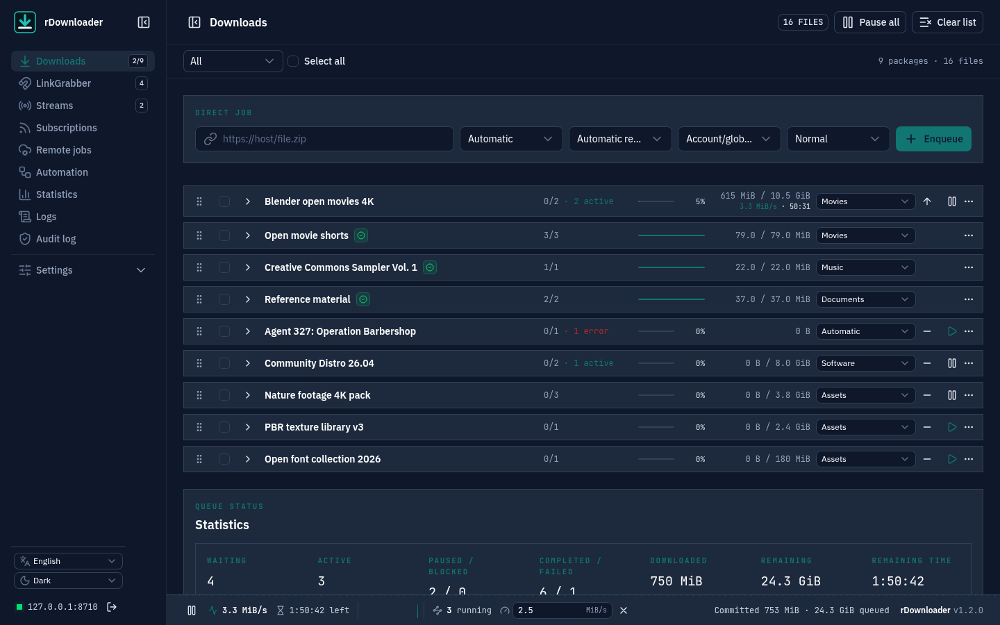
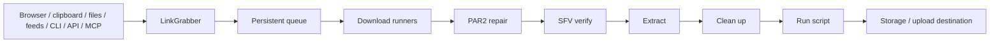
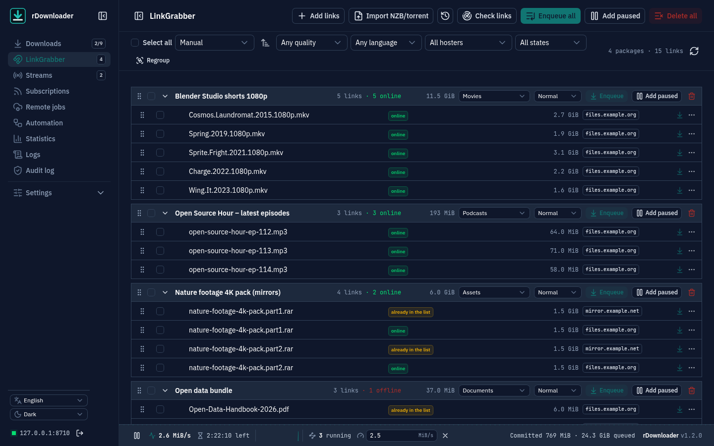

<p align="center">
  
</p>

<h1 align="center">rDownloader</h1>

<p align="center"><strong>One downloader. Every workflow.</strong></p>

<p align="center">
  A local-first download manager for HTTP, hosters, cloud drives, FTP/SFTP/WebDAV, Usenet, torrents, media, feeds, galleries and livestreams — with one persistent queue and automation around it.
</p>

<p align="center">
  <a href="https://github.com/degoya/rDownloader/releases">Download</a> ·
  <a href="docs/README.md">Documentation</a> ·
  <a href="https://rdownloader.net">Website</a> ·
  <a href="https://github.com/degoya/rDownloader/wiki">Handbook</a> ·
  <a href="CHANGELOG.md">Changelog</a> ·
  <a href="ROADMAP.md">Roadmap</a>
</p>

<p align="center">
  <a href="https://github.com/degoya/rDownloader/releases"></a>
  <a href="https://github.com/degoya/rDownloader/actions/workflows/ci.yml"></a>
  <a href="LICENSE"></a>
</p>

> **Status: early public release (alpha).** This is rDownloader's first public release. Expect
> rough edges, and read the note under *Supported sources* on what has and has not been run
> against real provider accounts. The project website is <https://rdownloader.net>, and the user
> handbook is the [wiki](https://github.com/degoya/rDownloader/wiki).



## What is rDownloader?

rDownloader brings different download sources into one local, persistent workflow. Collect links, files, feeds and subscriptions in the LinkGrabber, review and organize them as packages, control one shared queue, and automate what happens after a download: verification, repair, extraction, cleanup, scripts, notifications and upload.

The server is written in Rust and carries its responsive, installable Vue web interface inside the binary. Release builds target Windows, macOS and Linux, and a container image is built for `amd64` and `arm64`.

## Why rDownloader?

- **One queue across sources** — HTTP and hosters, cloud drives, FTP/FTPS, SFTP, WebDAV, Usenet/NZB, BitTorrent, video and audio, feeds, galleries and livestream recordings.
- **A real LinkGrabber** — collect from text, the clipboard, Click'n'Load 2, the browser extension, the web app's share target, `rdownloader://` links, hotfolders, feeds, NZB/torrent/DLC imports, REST, the remote CLI or MCP; then check, group, rename, route and queue.
- **Jobs at your provider** — hand a magnet, `.torrent`, NZB or link to a supported debrid or cloud account, follow it across a restart, and pick the finished files in the LinkGrabber.
- **Automation during and after download** — categories, schedules, bandwidth profiles, trigger/condition/action rules, checksums and SFV, PAR2, extraction, cleanup, scripts, notifications and storage/upload destinations.
- **Local-first** — binds to `127.0.0.1` by default, keeps credentials in an encrypted vault, scopes every machine token to the areas it needs, and restricts downloads to configured storage roots.
- **Extensible** — a native REST API with OpenAPI and Server-Sent Events, a built-in MCP server, SABnzbd- and qBittorrent-compatible adapters, a remote CLI, and signed WebAssembly plugins with an SDK and conformance tooling.
- **Restart-safe and observable** — transfers, post-processing and seeding pick up after a restart; a searchable log, an append-only audit log, transfer statistics and Prometheus metrics stay on your machine.
- **Four languages** — the interface and the browser extension speak English, German, French and Spanish.

## Supported sources

| Source | What rDownloader does | Requirement or note |
| --- | --- | --- |
| HTTP/HTTPS | parallel range chunks, safe resume, checksums, proxies, bandwidth limit | Range parallelism depends on the server |
| Hosters and multihosters | bundled resolvers, including a generic one for XFileSharing sites, MEGA with decryption on write, account selection, anonymous free flows, mirror failover | Accounts where a hoster needs one; a widget captcha needs the browser extension or a solver service |
| Cloud drives | Google Drive, OneDrive/SharePoint, Dropbox, Box and pCloud through their official APIs; files and folders | An account and an OAuth application you register yourself |
| Jobs at a provider | magnets, `.torrent`, NZB and links handed to Premiumize, TorBox, Offcloud, Put.io, Seedr or Real-Debrid; restart-safe; results in the LinkGrabber | An account at the provider |
| FTP/FTPS, SFTP, WebDAV | directory review, encrypted logins, validated resume, SSH host-key trust | Resume depends on the server; a changed SFTP host key is blocked |
| Usenet/NZB | NNTP connection pools, yEnc/CRC, segment resume, PAR2 repair | Your own Usenet access |
| BitTorrent | file and priority plans, trackers, peer and piece views, network controls, seeding | No BEP 19 web seeds |
| Video/audio | format filters, audio and subtitles, metadata, SponsorBlock, templates, subscriptions | `yt-dlp`; `ffmpeg`/`ffprobe` for the full workflow |
| Feeds and indexers | RSS/Atom, podcasts, Newznab/Torznab, filters, persistent history, your own scripts that print links | Reachable feeds and configured indexers |
| Galleries | one gallery per queue job, retries that skip what is already there | `gallery-dl` |
| Livestreams | record now or on a schedule, sidecars, split/remux, reconnect, VOD fallback | `streamlink`; what works depends on the source |

Hosters, providers and upstream tools change. Most provider integrations were built against their documented APIs and tested against recorded answers rather than live accounts; the provider notes in [`docs/feature-list.md`](docs/feature-list.md) say where a run against a real account is still missing.

## From capture to completion



PAR2 applies to Usenet packages; SFV verification works for any package. Which steps run is decided by package, category, global and automation settings — see [`docs/postprocessing.md`](docs/postprocessing.md).

## Quick start

1. Download the archive for your platform from [Releases](https://github.com/degoya/rDownloader/releases) and extract it.
2. Run `start-rdownloader.bat` (Windows), `./start-rdownloader.sh` (Linux) or `./start-rdownloader.command` (macOS).
3. Open <http://127.0.0.1:8710> and follow the setup wizard: administrator password, pairing the capture agent or browser extension, a storage destination, and optionally MCP access and provider or Usenet settings.

For Docker, [`docker/README.md`](docker/README.md) covers the image, Compose, volumes, `PUID`/`PGID` and a Synology walkthrough. Autostart, the capture agent, the browser extension and building from source are in [`docs/development.md`](docs/development.md).

> Media, gallery, stream, archive, Apprise and rclone features need their external tools. The Docker image ships FFmpeg, yt-dlp, streamlink, gallery-dl, 7-Zip, par2 and Apprise. A native install finds them in a `vendor/` folder beside the executable or on `PATH`, and can download managed yt-dlp and FFmpeg builds on Linux and Windows. RAR extraction needs `unrar` 6.10 or newer. Details: [`docs/external-tools.md`](docs/external-tools.md). Each Windows and Linux package names its version and commit in `VERSION.txt`.

## Platforms

| Platform | Server | Capture agent | Notes |
| --- | --- | --- | --- |
| Windows x86-64 | Native | Tray app | Portable binaries, `.nzb` association |
| macOS Intel and Apple Silicon | Native | Menu-bar app | LaunchAgent autostart; built and linted in CI, tests run on Linux and Windows |
| Linux x86-64 | Native | Headless | systemd user-service autostart |
| Docker `amd64`/`arm64` | Container | Not included | Use the browser extension or a desktop agent elsewhere |

The browser extension targets Chrome/Edge and Firefox from one Manifest V3 codebase ([`extension/README.md`](extension/README.md)).

## LinkGrabber



Collected links wait in the LinkGrabber before anything is queued. It takes browser and share-target captures, NZB and torrent files, DLC/CCF/RSDF/`.txt` containers, cloud and shared folders, release pages recognised by site rules, and subscription hits; checks them as each source allows; groups mirrors of the same file into one row; and can hide the links of chosen hosters. It asks before replaying a browser request that carries credentials, shows metadata and duplicates, groups multipart archives, and lets you set category, priority, archive password, processing level and script per package. Queue everything, a selection, or add it paused.

## MCP, REST and events

- MCP (Streamable HTTP): `/mcp`
- JSON API: `/api/v1`, described by `/api/v1/openapi.json`
- Server-Sent Events: `/api/v1/events`

API tokens are labelled, revocable and scoped to the permission areas a client needs; a read-only scope suits dashboards, and a metrics-only scope suits Prometheus. MCP and REST share the same application logic and validation, and each MCP tool costs the same area as the REST route behind it. The toolbox covers adding and controlling work, the LinkGrabber link by link, container and NZB imports, jobs at a provider, logs, audit records, statistics and the configuration. Tools that would hand out or take in a secret, give a consent, or change something outside the machine irreversibly are deliberately left out.

The SABnzbd and qBittorrent adapters implement documented subsets for Sonarr, Radarr, Lidarr, Readarr and similar clients. They are verified against the call sequence those clients issue, not yet against running instances — [`docs/compatibility.md`](docs/compatibility.md) lists every endpoint. Setup for MCP clients, the CLI and metrics is in [`docs/development.md`](docs/development.md).

## Signed WebAssembly plugins

Hosters, cloud drives, multihosters and many other extensions are signed `.rdplug` packages built against the versioned contract `rdownloader:plugin@0.9.0`, for every extension point: resolver, transfer, intake parser, authentication, OAuth, folder crawler, metadata enricher, notification destination, post-processing step, storage destination, remote job and stream transform. Plugins run without WASI inside a resource-limited sandbox, and their manifests declare the network, secret, resource, filesystem and process capabilities they need.

A package shows its permissions and publisher fingerprint before it is approved; a third-party signing key needs explicit approval. Version pinning for running jobs, switching a plugin off without removing it, key and per-package revocation, execution history, scaffolding, conformance checks and a reusable CI template support its lifecycle. There is no plugin repository and no staged update or rollback. See [`docs/plugins.md`](docs/plugins.md) and [`sdk/README.md`](sdk/README.md).

## Subscriptions, automations and notifications

Media and gallery subscriptions, RSS/Atom and podcast feeds, Newznab/Torznab indexers and your own scripts feed the LinkGrabber or the queue on a schedule, with persistent item history, filters and backlog protection.

The automation editor connects intake, resolution, start, completion, failure, extraction, script, upload and storage events to conditions and actions, with idempotency, retries and a run history. Signed webhooks, e-mail, ntfy (including your own server), Apprise-compatible services and notification plugins deliver filtered events while the browser is closed.

## Security and remote access

rDownloader binds to `127.0.0.1` by default. Provider, proxy and NNTP secrets live in an encrypted local vault; API tokens are stored only as SHA-256 digests. Sign-in takes a passkey or a password with an optional authenticator code, and sessions can be listed and ended. Authentication profiles are bound to their domains and redirects are contained. Security-relevant actions go to an append-only audit log.

rDownloader is a single-administrator application with no multi-user or role management. For remote access, put it behind a TLS reverse proxy and configure trusted proxies and the external URL; `rdownloader doctor` warns about half-configured setups ([`docs/reverse-proxy.md`](docs/reverse-proxy.md)). The interface targets WCAG 2.2 AA ([`docs/accessibility.md`](docs/accessibility.md)).

Report vulnerabilities privately through GitHub — [`SECURITY.md`](SECURITY.md) has the details.

## Architecture

```text
Rust server
├── Axum REST / SSE / MCP
├── Embedded Vue web app
├── SQLite persistence and a prioritized scheduler
├── HTTP / Usenet / torrent / FTP / SFTP / WebDAV and plugin-transfer runners
├── Media / gallery / stream runners
├── LinkGrabber, subscriptions, feeds and hotfolders
├── Bandwidth, power, capacity and notification services
├── Automation and compatibility adapters
├── Post-processing pipeline
├── Wasmtime plugin host
└── Encrypted secret vault
```

[`docs/architecture.md`](docs/architecture.md) describes every crate; [`docs/README.md`](docs/README.md) lists all documentation.

## Development and contributing

[`docs/development.md`](docs/development.md) covers running from source, building for every platform, the plugin components, the capture agent, the CLI, MCP setup and the quality checks. This repository receives one export per release. Issues and focused pull requests are welcome; [`CONTRIBUTING.md`](CONTRIBUTING.md) explains how a pull request is applied in the development repository and credited, and everyone taking part follows the [Code of Conduct](CODE_OF_CONDUCT.md).

## License

rDownloader is developed by Alexander Herling and licensed under the [GNU General Public License v3.0 or later](LICENSE). The version history is in [`CHANGELOG.md`](CHANGELOG.md).

Use rDownloader only for content you are permitted to access and download.
