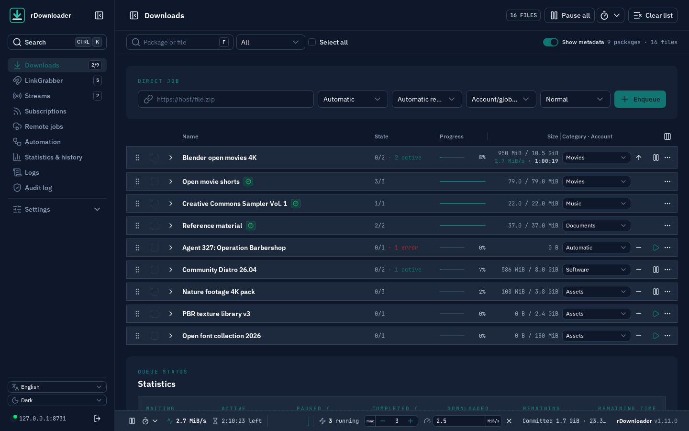

<p align="center">
  
</p>

<h1 align="center">rDownloader</h1>

<p align="center"><strong>One downloader. Every workflow.</strong></p>

<p align="center">
  <a href="https://rdownloader.net/download/">Download</a> ·
  <a href="https://rdownloader.net">Website</a> ·
  <a href="https://github.com/degoya/rDownloader/wiki">Handbook</a> ·
  <a href="CHANGELOG.md">Changelog</a> ·
  <a href="ROADMAP.md">Roadmap</a>
</p>

<p align="center">
  <a href="https://github.com/degoya/rDownloader/releases"></a>
  <a href="https://github.com/degoya/rDownloader/actions/workflows/ci.yml"></a>
  <a href="LICENSE"></a>
</p>

rDownloader is a local-first download manager for HTTP, hosters, cloud drives, FTP/SFTP/WebDAV,
Usenet, torrents, media, feeds, galleries and livestreams — collected in one LinkGrabber, run
from one persistent queue, and finished by automation. It is a Rust server with an embedded,
installable Vue web interface, for Windows, macOS, Linux and Docker.

> **Early public release.** Expect rough edges. Most provider integrations are tested against
> recorded answers rather than live accounts; the handbook says where.



## Features

- **One queue across sources** — HTTP, hosters and multihosters, cloud drives, FTP/FTPS, SFTP, WebDAV, Usenet/NZB, BitTorrent, video and audio, feeds, galleries and livestreams.
- **A real LinkGrabber** — collect from the browser, the clipboard, Click'n'Load, files, feeds and hotfolders; check, group mirrors, rename and route before queuing.
- **Jobs at your provider** — hand a magnet, torrent, NZB or link to a debrid or cloud account and pick the finished files.
- **Post-processing** — checksums and SFV, PAR2 repair, extraction, cleanup, scripts and upload destinations.
- **Automation** — categories, schedules, bandwidth profiles, subscriptions and trigger/condition/action rules.
- **Notifications** — signed webhooks, e-mail, ntfy, Apprise and notification plugins.
- **Local-first** — binds to `127.0.0.1` by default, keeps credentials in an encrypted vault and scopes every API token.
- **Integrations** — REST API with OpenAPI and Server-Sent Events, a built-in MCP server, SABnzbd- and qBittorrent-compatible adapters for the *arr tools, a remote CLI.
- **Signed WebAssembly plugins** — sandboxed extensions built against the versioned contract `rdownloader:plugin@0.10.0`, with signed repositories and an SDK.
- **Restart-safe** — transfers, post-processing and seeding resume after a restart; logs, audit log, statistics and Prometheus metrics stay local.
- **Four languages** — English, German, French and Spanish, in the interface and the browser extension.

## Install

Download the archive for your platform from [rdownloader.net/download](https://rdownloader.net/download/) or [GitHub Releases](https://github.com/degoya/rDownloader/releases), run `start-rdownloader`, and open <http://127.0.0.1:8710> for the setup wizard. Windows also has a per-user installer, `rdownloader-windows-x86_64.msi`, on the same release page; Linux has deb and rpm packages for x86-64 and arm64. Linux binaries need glibc 2.39 or newer; use Docker on older systems.

```bash
# macOS and Linux (Homebrew)
brew install degoya/rdownloader/rdownloader && brew services start rdownloader

# Windows (Scoop)
scoop bucket add rdownloader https://github.com/degoya/scoop-rdownloader
scoop install rdownloader

# Debian and Ubuntu (signed apt repository)
sudo install -d -m 0755 /etc/apt/keyrings
curl -fsSL https://degoya.github.io/rdownloader-packages/rdownloader.asc | sudo tee /etc/apt/keyrings/rdownloader.asc > /dev/null
curl -fsSL https://degoya.github.io/rdownloader-packages/rdownloader.sources | sudo tee /etc/apt/sources.list.d/rdownloader.sources > /dev/null
sudo apt update && sudo apt install rdownloader

# Fedora (signed dnf repository)
sudo curl -fsSL -o /etc/yum.repos.d/rdownloader.repo https://degoya.github.io/rdownloader-packages/rdownloader.repo
sudo dnf install rdownloader

# deb and rpm start per user, as a systemd user service
systemctl --user daemon-reload && systemctl --user enable --now rdownloader

# Docker (amd64/arm64); docker/README.md covers Compose, volumes and NAS setups
docker run -d --name rdownloader -p 127.0.0.1:8710:8710 \
  -v rdownloader-config:/config -v "$HOME/Downloads:/downloads" \
  -e PUID="$(id -u)" -e PGID="$(id -g)" \
  ghcr.io/degoya/rdownloader:latest
```

The browser extension is in the [Chrome Web Store](https://chromewebstore.google.com/detail/rdownloader/nfdbhbkjnbdnaaekabaochlhgkaafnda) and on [Firefox Add-ons](https://addons.mozilla.org/addon/rdownloader/).

## Documentation

The [handbook](https://github.com/degoya/rDownloader/wiki) covers everything in detail:

- **Getting started** — [Installation](https://github.com/degoya/rDownloader/wiki/installation) · [First run](https://github.com/degoya/rDownloader/wiki/first-run) · [Your first download](https://github.com/degoya/rDownloader/wiki/first-download)
- **Using** — [LinkGrabber](https://github.com/degoya/rDownloader/wiki/linkgrabber) · [Download queue](https://github.com/degoya/rDownloader/wiki/download-queue) · [Hosters and accounts](https://github.com/degoya/rDownloader/wiki/hosters-and-accounts) · [Post-processing](https://github.com/degoya/rDownloader/wiki/post-processing) · [Automation](https://github.com/degoya/rDownloader/wiki/automation)
- **Integrations** — [Browser extension](https://github.com/degoya/rDownloader/wiki/browser-extension) · [MCP server](https://github.com/degoya/rDownloader/wiki/mcp-server) · [REST API](https://github.com/degoya/rDownloader/wiki/rest-api) · [Sonarr, Radarr and other *arr tools](https://github.com/degoya/rDownloader/wiki/automation-tool-compatibility) · [Command line client](https://github.com/degoya/rDownloader/wiki/command-line-client)
- **Plugins** — [Overview](https://github.com/degoya/rDownloader/wiki/overview) · [Installing and trust](https://github.com/degoya/rDownloader/wiki/installing-and-trust) · [Bundled plugins](https://github.com/degoya/rDownloader/wiki/bundled-plugins)
- **Operating** — [Docker and NAS](https://github.com/degoya/rDownloader/wiki/docker-and-nas) · [Reverse proxy](https://github.com/degoya/rDownloader/wiki/reverse-proxy) · [Backup and restore](https://github.com/degoya/rDownloader/wiki/backup-and-restore) · [Troubleshooting](https://github.com/degoya/rDownloader/wiki/troubleshooting)
- **Security and privacy** — [Security and privacy](https://github.com/degoya/rDownloader/wiki/security-and-privacy) · [Accounts, sessions and permissions](https://github.com/degoya/rDownloader/wiki/accounts-sessions-and-permissions)
- **Plugin development** — [Developing a plugin](https://github.com/degoya/rDownloader/wiki/developing-a-plugin) · [Plugin reference](https://github.com/degoya/rDownloader/wiki/plugin-reference) · [`sdk/README.md`](sdk/README.md)
- **Building from source** — [Building from source](https://github.com/degoya/rDownloader/wiki/building-from-source)

## Contributing

Issues and focused pull requests are welcome; [`CONTRIBUTING.md`](CONTRIBUTING.md) explains how a pull request is applied and credited, and everyone taking part follows the [Code of Conduct](CODE_OF_CONDUCT.md). Running a hosting, debrid, Usenet or cloud service? A [provider support request](https://github.com/degoya/rDownloader/issues/new?template=provider_support.yml) is welcome — never post credentials there.

## Security

Report vulnerabilities privately through GitHub; [`SECURITY.md`](SECURITY.md) has the details.

## License

rDownloader is developed by Alexander Herling and licensed under the [GNU General Public License v3.0 or later](LICENSE). Use it only for content you are permitted to access and download.
