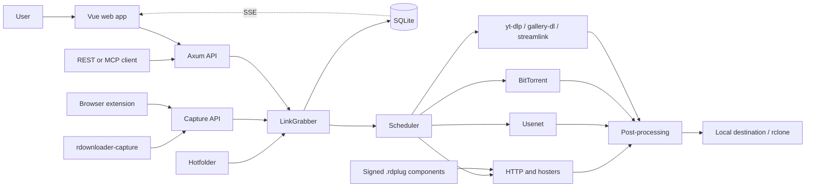
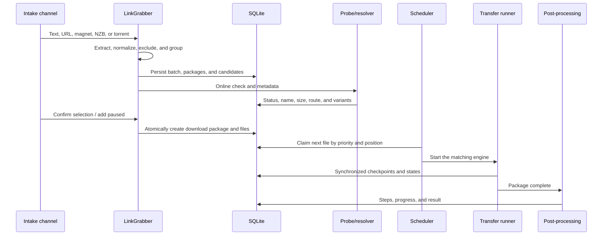

# rDownloader — Design and Architecture

> Status: September 2, 2026 · Project version `0.4.0`, including the current
> `Unreleased` changes. This document describes the system implemented in the repository.
> Planned features are not described here; [`ROADMAP.md`](ROADMAP.md) summarises them.

## Purpose and Design Goals

rDownloader is a local-first, cross-platform download manager. The system brings direct HTTP(S)
downloads, one-click hosters, Usenet/NZB, BitTorrent, media sites, image galleries, and livestream
recordings into one persistent package queue. A Rust service provides the scheduler, REST and MCP
interfaces, and the embedded Vue frontend. A desktop capture agent, browser extension, and
hotfolders provide additional intake channels.

| Attribute | Value |
| --- | --- |
| Product | rDownloader |
| Author | Alexander Herling |
| Repository | `https://github.com/degoya/rDownloader` |
| License | GNU GPL v3.0 or later |
| Backend | Rust 2024, minimum version 1.98 |
| Frontend toolchain | Node 24 and npm 11 |
| Target platforms | Windows, Linux, macOS, and Docker |

The architecture follows six guiding principles:

1. **Local first:** The service binds to `127.0.0.1:8710` by default. Data, credentials, and
   download state remain under the operator's control.
2. **One queue:** Every transfer type uses the same packages, priorities, states, controls, and
   status presentation.
3. **Recovery rather than restart:** Transfer, segment, verification, and post-processing progress
   is persisted so that a process failure repeats as little work as possible.
4. **Secure boundaries:** Storage destinations are allowlist-based, secrets live outside the
   domain database, and plugins run signed, without WASI, in a constrained sandbox.
5. **Replaceable integrations:** Protocol-specific runners and versioned resolver plugins sit
   behind stable domain contracts.
6. **Live without excessive traffic:** Persistent mutations emit domain events; high-frequency
   progress events are throttled before being distributed to the UI through Server-Sent Events.

## System Context



### Runtime Topology

- `rdownloader serve` initializes paths, SQLite, the secret store, settings, plugins, transfer
  runners, the scheduler, post-processing, torrent recovery, hotfolders, and the API.
- The compiled SPA from `web/dist` is embedded into the same binary by `rd-api` and served through
  the API port.
- `rdownloader-capture` is a separate desktop process. It can also connect to an rDownloader
  service running on a NAS or in Docker.
- The browser client is same-origin. Capture endpoints have deliberately scoped CORS support; the
  MCP endpoint deliberately does not.
- During shutdown, the stream monitor, torrent service, hotfolders, link checker, post-processing,
  and scheduler stop in a controlled order. SQLite performs a WAL checkpoint.

## Components

| Component | Responsibility |
| --- | --- |
| `rdownloader` | CLI, service startup, configuration wiring, diagnostics, plugin commands, and autostart commands |
| `rd-api` | Axum router, REST, authentication, SSE, OpenAPI, MCP, and the embedded SPA |
| `rd-core` | Domain models, typed UUIDv7 IDs, states, failures, events, and shared settings |
| `rd-db` | SQLite migrations, reader pool, serialized writer, and atomic domain events |
| `rd-scheduler` | Prioritized queue, concurrency limits, retries, provider slots, and runner orchestration |
| `rd-http` | Probing, range/chunk engine, resume, cookies, proxy/TLS, and bandwidth limiting |
| `rd-captcha` | Solver service, manual image captchas, transient captcha queue, and live events |
| `rd-usenet` | NNTP pool, server fallback, yEnc/CRC, segment resume, and assembly |
| `rd-torrent` | Embedded `librqbit` session, torrent runner, and seeding supervision |
| `rd-media` | Metadata and media downloads through `yt-dlp`, `ffmpeg`, and `ffprobe` |
| `rd-gallery` | Gallery downloads through `gallery-dl` |
| `rd-stream` | Livestream probing and recording through `streamlink` |
| `rd-collector` | Link extraction, normalization, NZB parsing, and automatic package creation |
| `rd-hotfolder` | File-system watcher and safe intake of NZB and torrent files |
| `rd-extract` | Persistent post-processing pipeline, recovery, scripts, and uploads |
| `rd-postprocess` | Archive formats, multipart detection, passwords, PAR2, and extraction backends |
| `rd-files` | Safe paths, file names, part files, checksums, and storage roots |
| `rd-plugin-api` | WIT contract `rdownloader:resolver@0.5.0` and shared plugin types |
| `rd-plugin-host` | Native resolvers, Wasmtime runtime, package verification, and installation |
| `rd-provider-registry` | Central provider, domain, alias, and credential metadata |
| `rd-secrets` | Encrypted local secret store |
| `rd-capture` | Click'n'Load, clipboard, NZB association, pairing, and tray/menu-bar integration |
| `rd-autostart` | Platform-specific autostart registration |

Crates are separated by responsibility rather than by individual UI pages. `rd-core` contains no
infrastructure. `rd-api` coordinates application use cases, while concrete transfer behavior stays
inside the scheduler, runners, and protocol crates.

### Technology Stack

| Area | Technology |
| --- | --- |
| Async/server | Tokio 1, Axum 0.8, and Tower HTTP 0.6 |
| HTTP/TLS | Reqwest 0.13, rustls 0.23, and platform certificate verification |
| Persistence | SQLite with SQLx 0.8 and embedded migrations |
| Contracts | Serde, Utoipa/OpenAPI 3, and `openapi-typescript` |
| Live updates | Tokio broadcast channels and Server-Sent Events |
| MCP | `rmcp` 3.2 over Streamable HTTP |
| Plugins | Wasmtime 48, WebAssembly Component Model, WIT, and Ed25519 |
| Torrent | `librqbit` 9 |
| Frontend | Vue 3.5, TypeScript 5.9, Vite 7, and Nuxt UI 4.11 |
| UI state | Pinia 3, Pinia Colada, and VueUse 14 |
| Localization | Vue I18n 11 |
| Tests | Rust test/Nextest, Vitest 4, and Testing Library Vue |

## Primary Data and Control Flows

### From Intake to Download



Intake sources are `manual`, `clipboard`, `click_and_load`, `api`, `nzb`, `hot_folder`, and
`browser_extension`. Links are checked before queueing; duplicates remain visible and may be
queued again after explicit confirmation. Categories are selected by prioritized first-match
rules.

### Scheduler and Transfers

- The queue sorts first by `high`, `normal`, and `low` priority, then by manual position.
- Regular files share the global active-file limit. Open-ended recordings and suitably declared
  external runners may use dedicated slots.
- Providers limit concurrent resolution/download work through semaphores. Free downloads have a
  separate capacity-one slot per hoster and do not consume premium slots.
- `ip_blocked` holds back only free links for the same normalized hoster; other hosters and premium
  downloads continue running.
- Retries use the greater of exponential backoff, capped at 300 seconds, and the server-provided
  `Retry-After`, plus up to one second of jitter. IP blocks without a provider-supplied delay use a
  default hold-off of 15 minutes.
- HTTP files are probed before transfer. Range support, size, ETag, and Last-Modified determine the
  chunk plan and whether resume is safe.
- A chunk checkpoint is written only after the corresponding file data has been synchronized.
  Final files are moved atomically into place and may be verified with checksums.

### Free Hoster Downloads and Captchas

Resolvers may reproduce a hoster's browser flow without an account: load the file page, submit the
download form, wait for the countdown through the `wait` host function, solve a captcha through
`solve-captcha`, and return the final URL. Waiting consumes neither plugin fuel nor compute timeout,
but remains bounded by `wait_budget_milliseconds`.

The captcha broker tries a configured 2captcha-compatible service first. Temporary solver errors
fall back to manual input for image and click-point captchas; an invalid key or exhausted balance
is treated as a permanent configuration failure. reCAPTCHA v2, hCaptcha, and Turnstile are bound
to the hoster's domain and are answered by a solver service or by the person in their own browser
through the extension; CutCaptcha only by a service, and without one it is refused at once with
`captcha.cutcaptcha_needs_solver`. A click-point answer is a coordinate, returned to the plugin
through `solve-challenge`; `solve-captcha` stays the token form. Manual captchas exist only in
memory and are distributed live through `captcha.changed`; they are not restored after a restart.

### Post-processing

The effective level is resolved in the order package → category → global setting. Levels are
cumulative: `none`, `repair`, `unpack`, and `delete`.

```text
PAR2 verify/repair
  → extract archives
  → delete source archives
  → apply cleanup rules
  → run user script
  → optionally upload through rclone
```

Each step and its progress is persisted. Extraction uses a staging area; only complete results are
moved into the package directory. Recursive extraction is optional, limited to three additional
passes, and disabled for torrents while they are seeding.

## Domain Model

The primary aggregates are:

- `DownloadPackage`: name, destination, category, priority, position, kind, password indicator,
  post-processing configuration, and package state.
- `DownloadFile`: source, file name, transfer state, byte counters, retry time, checksums,
  resolver/network route, and protocol-specific metadata.
- `CollectorBatch`, `CollectorPackage`, and `LinkCandidate`: the persistent check and review area
  before the queue.
- `StorageRootConfig`, `Category`, `CategoryRule`, and `HotFolderConfig`: controlled storage and
  automatic routing.
- `Account`, `ProxyProfile`, `UsenetServer`, and `StreamChannel`: external connections and runners.
- NZB imports, NZB files, and segments: Usenet metadata and resume checkpoints.
- Plugin trust, capture/API tokens, and settings documents: system configuration and security.

64-bit byte counts are transferred as decimal strings in the JSON contract. This keeps values
above JavaScript's safe integer range exact. IDs are typed UUIDv7 values so that aggregates cannot
accidentally be addressed with the wrong ID type.

### States

Files use `queued`, `resolving`, `downloading`, `paused`, `retry_wait`, `verifying`, `repairing`,
`extracting`, `seeding`, `blocked`, `failed`, `cancelled`, and `completed`. The domain type validates
allowed transitions; direct transitions such as `completed → downloading` are forbidden.

Packages summarize file state as `queued`, `downloading`, `postprocessing`, `completed`, or
`failed`. LinkGrabber candidates use `resolving`, `checking`, `online`, `offline`, `unsupported`,
`unresolvable`, `duplicate`, `enqueued`, and `error`. A candidate whose check left a message
carries a stable code beside it, resolved as `server.codes.<code>`, with the English text only as
the fallback — free prose printed verbatim is how one sentence came to stand for three different
situations.

Failures contain a category, redaction-safe English message, optional stable code, and string
parameters. Categories distinguish transient, permanent, offline, authentication, rate-limit,
captcha, IP-block, and unsupported cases. This lets the UI and MCP share application logic while
the UI localizes the user-facing message.

## Persistence and Consistency

- SQLite runs with foreign keys, WAL, and `synchronous=NORMAL`.
- A single writer actor processes mutations serially; up to four readers may query concurrently.
  This avoids competing SQLite writes.
- A domain mutation and its persistent event are committed in the same transaction.
- Progress events are throttled to approximately 750 ms per download. Purely transient state such
  as pending captchas is broadcast only.
- The schema evolves only through numbered SQLx migrations in `crates/rd-db/migrations`.
- Resume metadata includes HTTP validators and chunk offsets, Usenet segment ranges and CRCs,
  torrent sessions, and post-processing steps.
- Configuration imports are validated in full and replace the affected tables atomically.

## API and Event Design

### Interfaces

| Interface | Path/transport | Authentication | Use |
| --- | --- | --- | --- |
| REST | `/api/v1/*`, JSON | Session, except for public endpoints | Web app and integrations |
| SSE | `/api/v1/events` | Session | Live updates |
| MCP | `/mcp`, Streamable HTTP | Bearer token with `api:*` scope | AI assistants |
| Capture | `/api/v1/capture/*` | Bearer token with capture scope | Agent and browser extension |
| SPA | Fallback routing | In-app authentication gate | Web interface |

The health endpoint, authentication status, initial password setup, login, and OpenAPI document are
public. All regular management and download endpoints require an administrator session. API and
capture tokens belong to separate permission spaces and are not interchangeable.

The REST error format is `{ "error": string, "code": string?, "params": object? }`. OpenAPI is
generated from Rust handlers and checked into `web/openapi.json`; `web/src/api/schema.d.ts` is
generated from it. Contract changes therefore begin in Rust, not in generated TypeScript types.

Event families cover download progress/state, package state, collector, category, hotfolder,
capture, account, proxy, Usenet, plugin, stream, post-processing, captcha, and system changes.

## Plugin Design

Resolvers are distributed as signed `.rdplug` archives. A package contains a manifest, WebAssembly
component, signature, and optional translations. The current contract is
`rdownloader:resolver@0.5.0` and covers URL matching, account checks, resolution, link checks, the
hoster catalog, and host functions for HTTP, cookies, secret lookup, logging, waiting, and captcha
solving.

The trust chain consists of the embedded release key, additional configured keys, and explicitly
confirmed trust on first use. Signatures are checked during installation and startup. The highest
installed compatible SemVer version wins for new jobs; running or pinned jobs retain their
assigned version.

Sandbox boundaries:

- no WASI, and therefore no general file, process, or socket access;
- network access only through the host and manifest domain lists;
- secret access only for declared references and domains;
- limits for memory, fuel, compute time, response size, and a separate wait budget;
- incompatible or faulty plugins must not prevent the service from starting.

Bundled resolvers are DDownload, Rapidgator, Nitroflare, KatFile, 1fichier, Keep2Share, FileJoker,
Premiumize.me, AllDebrid, Debrid-Link, and LinkSnappy. Native resolvers act as fallbacks and share
provider metadata with the components.

## Frontend and UX Design

### Information Architecture

The SPA has these primary sections:

1. **Downloads:** Package/file list, states, progress, queue actions, statistics, and
   post-processing.
2. **LinkGrabber:** Link, NZB, and torrent review; checks; grouping; and queueing.
3. **Streams:** Immediate recording and persistent channel monitoring.
4. **Statistics:** The persistent transfer figures over a chosen range — stat tiles, bytes per
   hour or day as bars, and the range by kind and by provider — plus the metrics endpoint. The
   range switch is a group of pressed buttons in the navbar rather than a select: four values,
   all visible, one click each. Bars, not a line: a bucket is a sum over an hour or a day, and a
   line would invite reading a slope between two sums.
5. **Remote jobs:** The jobs running at a provider — submitted, watched, answered and ended
   here. Beside the subscriptions, not under the accounts: a job somebody has to watch and
   answer is not a setting (RD-110-29).
6. **Audit log:** The append-only record of the security-relevant actions — who acted, from
   where, on what, how it ended. A page of its own rather than a tab of the log viewer, because
   the two lists answer different questions, are kept for different lengths of time, and a
   security surface should not be one click deep inside a diagnostics page (RD-110-03). It
   follows the row conventions like every other list: filters above, "full page" said out loud,
   details behind the chevron pair. The page offers **no destructive control at all** — there is
   no route that could serve one, and a button that suggested otherwise would be a lie in the
   interface; the export sits beside the filters, because the file *is* the filter.
7. **Settings:** Twenty-five directly addressable pages in six rubrics, the same in the
   sidebar and on the entry page at `/settings`: General (General, Interface, Desktop client),
   Downloads (Storage & rules, Hotfolders, Bandwidth, Unattended operation, Post-processing),
   Sources & protocols (Accounts, Captcha & solver, Site rules, Usenet, BitTorrent, Media,
   FTP/SFTP/WebDAV), Integrations (Services, Plugins, Tools, Notifications, API & MCP), Network
   & security (Network, Security) and Administration (Backup & restore, System, About
   rDownloader). The table is
   one module, `settingsSections.ts`, and a test holds it to the owner's decision of
   2026-09-22. *Site rules* sits under Sources & protocols by the rubric's own test: a rule
   decides which services rDownloader recognises, which is where the bytes come from, not what
   happens to the queue afterwards (RD-110-08).

A collapsible, resizable sidebar contains navigation and live badges. A persistent transfer rail
shows global queue state. The captcha dialog and file-drop overlay sit above individual routes
because both may become active on any page.

At startup, the application moves through Loading → Setup Wizard or Login → Control Room. After a
session becomes ready, transfers, the collector, and captchas connect to the event stream; streams
and other initial data are loaded once.

### Visual Language

- **Typography:** IBM Plex Sans Variable for UI and prose, JetBrains Mono Variable for numbers,
  addresses, status details, and eyebrow labels.
- **Primary color:** `signal`, a custom teal scale from `#edfffd` to `#052f30`.
- **Secondary color:** cyan; **neutral:** slate; **warning:** amber; **error:** a custom `coral`
  scale from `#fff2f1` to `#41110f`.
- **Shape:** A small global radius of `0.3rem`; functional, compact surfaces rather than large
  decorative card radii.
- **Motif:** A subtle 28 px signal grid for loading and introductory surfaces; transfer stripes
  indicate activity without replacing text.
- **Themes:** Light, dark, and system. Components use semantic Nuxt UI tokens so that contrast and
  state meaning survive across themes.

Queue rows and the LinkGrabber's link rows share one responsive grid of nine named cells. Below
560 px the row is two lines, with the name on the first and the state on the second; from 560 px
it is one line, progress joins at 768 px, and size plus additional metadata at 1280 px. The widths
behind those numbers are measured and recorded under "What a queue row may spend its width on"
below, together with why the subscription rows wrap instead. Numbers use tabular figures to
prevent columns from shifting during live updates.

### Interaction Rules

- Primary actions are state-dependent; mutually invalid actions are not offered together.
- Destructive actions require explicit confirmation.
- Server failures appear localized while retaining stable error codes as the contract.
- Forms expose loading, success, and error states. Self-saving settings areas remain separate from
  the shared settings document. Areas that *fetch* expose the same three, under the rule below.
- Full-page refresh is not the normal update path; SSE or local store updates keep views current.
- Global keyboard shortcuts, numbered in sidebar order: `1` Downloads, `2` LinkGrabber,
  `3` Streams, `4` Subscriptions, `5` Remote jobs, `6` Automation, `7` Settings, plus `0`
  sidebar, `N` import, `P` global start/pause, and `?` help. A new navigation entry takes the
  number of its place and renumbers what follows, so the keys keep reading top to bottom.
- The UI is fully translated into English, German, French, and Spanish. Plugin messages are merged
  into the same locale namespace at runtime.
- Settings navigation follows stable task groups rather than an alphabetical order that changes
  with the selected language. Group labels are headings, never expandable detours: every settings
  page remains one click away after Settings is open, including in the collapsed sidebar popover.
- **A settings page sits where somebody looks for it, and the rubric says what that is.** The
  six rubrics are subjects, not containers of convenience: *Downloads* is what happens to the
  queue, *Sources & protocols* is where the bytes come from, *Integrations* is what the service
  talks to, *Network & security* is the way in and out. A card goes on the page whose subject it
  is, never on the page that happened to have room — tools were under Interface, quiet hours
  under Bandwidth, the captcha solver under Network, and each of them was found by scrolling
  rather than by looking (RD-110-29). A new setting first asks which of the six it belongs to;
  a setting that fits none is a sign the rubric is missing, not that one should be stretched.
- **The settings open on an overview, not on a page.** `/settings` shows one card per page under
  its rubric, in the sidebar's order, each carrying the page's own title and description — the
  same header the page then opens with — and each a link, so the keyboard reaches the cards the
  way it reaches the sidebar. The overview reads the same table the sidebar reads; there is no
  second list to drift. What it does not do: hold settings itself, or promote a page above the
  others. A redirect to one page, as `/settings` used to be, makes the way into the settings
  lead to a status page with sixteen siblings hidden behind a sidebar group.
- **Every settings page opens with the same header, and a test counts it.** One `SectionHeader`
  at `level="page"`, eyebrow, title and one sentence, before anything else; the sentence is the
  one the overview card shows. A page without it — the desktop page had a bare paragraph, the
  security page nothing — reads as a fragment of another page.
- **A measured figure that cannot be measured shows nothing.** Estimates — the remaining time is
  the first of them — print no placeholder, no `∞` and no "calculating…" when the inputs are
  missing. The field is simply empty, and any caption beside it says what the neighbouring figure
  does include rather than letting it count things silently. An estimate the interface cannot
  stand behind is worse than an absent one, because a reader cannot tell the two apart.
- **The browser tab is a status line, and exactly one place writes it.** While transfers are
  running the title reads `<rate> · <count> active · rDownloader`, rate first because a narrow
  tab shows only its first characters; at rest it is the application name alone. It is derived
  from the shared stores in a single composable called once from `App.vue`, never per view — two
  writers would fight on every route change — and the rule above applies to it: a rate that is
  not a usable figure is left out rather than printed as a placeholder. The whole behaviour is
  one switch in Interface settings, because a title that keeps changing is a distraction for
  some people and that is not arguable.
- **The tray line is the same status line under a different constraint.** The desktop agent's menu
  entry and tooltip read `<counts> · <progress> · <rate> · <remaining> left`, widest context
  first because the line is read whole rather than truncated from the left. Rate and remaining
  time come from the service, never from the agent's own arithmetic, and they stand or fall
  together: both only while something is actually running, because either one beside a resting
  queue reads as motion. The rule two bullets up applies unchanged — an estimate the service
  cannot stand behind leaves the segment out. Untranslated, because the agent carries no
  catalogue (RD-092-05). Where the surface has a hard buffer, as the Windows tooltip does at 128
  characters, the line is cut to fit rather than trusted to be short; the menu entry, which has
  no such buffer, keeps it whole.
- **The sidebar collapses to an icon rail, and the way back out stays on screen.** The switch is
  Nuxt UI's own `UDashboardSidebarCollapse` in the sidebar header, not a second mechanism beside
  it, and `0` does the same from the keyboard. The rail is 64 px wide and its header keeps
  32 px between the paddings: one control, which the 32 px logo would fill by itself. So on
  the rail the logo *is* the switch — the mark as the button's face, the panel icon hidden —
  rather than the wordmark yielding the place and leaving the rail without the application's
  own mark (RD-110-32). A control that hides itself when used leaves the reader with a strip
  of icons and no stated way back, and a logo that is a button states it: the tooltip and the
  accessible name say *Expand sidebar*. It is the same element in both states, so the focus of
  whoever pressed it stays on it. The switch is named for the state it would produce —
  *Collapse sidebar* while open, *Expand sidebar* while collapsed — in all four languages. The
  choice belongs to the session and survives every route change; below the large breakpoint
  the sidebar is a drawer and the switch is not shown (RD-109-31). At the foot of the rail,
  language and theme — two selects while expanded, one per row, because side by side each kept
  20–30 px for its value (RD-120-53) — are one menu behind a gear
  (`i-lucide-settings-2`, not the navigation's settings icon: this is not the settings page),
  named for both, *Language and theme*, never for one of them. The footer takes the sidebar's
  width in both states — its separator and selects run where the navigation's separator runs —
  and on the rail the connection dot and the sign-out button stack, since side by side they need
  56 of the 32 px between the paddings (RD-120-61). The open sidebar is a share of
  the window (15 %, dragged between 14 and 21 %) with a floor of 15rem, 240 px: at 15 % of
  1280 px it was 192 px and cut the application's name, "Téléchargements" and "Entfernte
  Aufträge". Its header carries the logo and the name and nothing under them; the tagline that
  stood there needed up to 223 px of 117 and was removed by the owner's decision (RD-120-53).
  Navigation labels wrap rather than being cut, which only the settings pages' longer names ever
  need.
- **On a settings page the settings group is open and highlighted, and the navbar names the
  page.** The group opens whenever a settings route is entered — not once when the shell mounts,
  which happens before the first route resolves — and a reader who closes it keeps it closed.
  The entry is marked active on every settings page, because the pages are routes of their own
  and the router would not. The navbar title is the page's sidebar label, as every other view's
  title is its own; only the overview at `/settings` says *Settings* (RD-120-53).
- **What a choice governs stands after the choice.** A control that decides which fields exist,
  which of them are required, or what a field is called belongs directly above all of them — and
  it is already answered when the form opens, with the first option its subject offers, rather
  than starting blank. A form filled from the top down must never ask three questions before the
  one that decides whether those questions exist. The account form did exactly that: sign-in
  method came after display name, username and connection route, no method was selected at all,
  and the secret field beneath therefore read *DDownload password or API key* — one box for two
  answers. A label naming two possible answers is the symptom; the cure is the order and the
  preselection, not a longer label (RD-109-35).
- **A name the application chose may still improve; a name a person chose is final.** Intake has
  to name a package before anything is known about it, and for a single link whose address offers
  nothing it can only fall back to the hoster. Such a name is a placeholder, and the interface is
  allowed to replace it the moment something better arrives — the file name a resolver or a check
  reports — without asking, because nobody chose the name being replaced. The moment a person
  types one, or a container or a common stem supplies one, it stands: it is never overwritten by
  a later discovery, and changing it is a deliberate action with its own confirmation. The test
  is the origin of the current name, never its quality. Where such an automatic rename also moves
  data, it happens before the data exists rather than afterwards, and a destination that is
  already occupied stops the rename instead of merging into it (RD-109-45).
- **A click in a picture is an answer, and answering is a separate step from aiming.** A
  click-point captcha is answered by clicking the picture, and a wrong spot is a wrong answer
  that fails the download — so the first click only marks, a later click moves the mark, and
  the same *Send answer* button that sends typed text sends the mark. The interface says where
  the mark is, in the picture's own pixels, and the mark is drawn as a share of the picture so
  it stays put when the dialog scales the image. Nothing is ever sent on the click itself. The
  picture is a `<button>` with a name, because a click handler on a plain element is out of
  reach for a keyboard (`docs/accessibility.md`): the arrow keys move the mark one pixel, ten
  with `Shift`, starting from the centre of the picture, the position beneath it is a
  `role="status"` line so a screen reader hears where the mark went, and `Enter` or `Space`
  sends it — the same route the button offers, never a shortcut past it (RD-110-15).
- **A credential from the browser takes two consents, in two places, and the service names the
  site.** The service cannot read a browser's cookies, so an account's session at its provider
  comes from the extension (RD-120-45). The person asks for it at the account in the web
  interface (*Take over from browser*, shown only where an installed plugin declares a
  `cookie_scope`); the request waits there with a line that says where to answer it and a way
  to withdraw it. The extension then shows the request in its popup — site and account named —
  with *Hand over* and *Decline*, and the click on *Hand over* is the second consent and the
  gesture for the browser's own permission prompt for `cookies` and that one origin. The site is
  never typed, picked or read off a page: it is the plugin's scope, carried by the request. The
  outcome comes back to the row (arrived and checked, declined, expired), and the grant is given
  back in the browser. A capture token alone can therefore not start a handover, choose an
  account or widen a domain — it can only answer what a person asked for, once. A sign-in that
  cannot finish because the browser is signed in already says so and names this way out, rather
  than waiting out a timeout in silence.

### Fetching, Empty, and Failed

An area that fetches its data is in exactly one of three states, and it says which one. Until
1.0.4 it said none of them: the list was empty while the request was in flight, so the empty state
rendered — "no accounts", "no downloads", "no subscriptions" — and if the request failed the list
stayed empty, so the same sentence rendered again. Both are false statements. The second is the
worse one, because it turns a server failure into "nothing there" and gives the reader nothing to
act on.

- **Loading.** While the first fetch is outstanding, the area shows the 28 px signal grid named
  under Visual Language, with pulse bars standing in for the rows that are coming, and the word
  for loading beneath them. The grid is the motif for loading surfaces; this is where it is used
  during a fetch rather than only on introductory screens. The **first** fetch is meant
  literally: a later refresh never re-enters this surface. Lists refresh on state events, poll
  timers and after every write, and an area that re-enters loading on each of them replaces its
  empty state with the skeleton for a few milliseconds at a time — a flicker the reader sees
  precisely because nothing renders here once there is content (RD-106-19). The flag a view
  binds therefore describes the first fetch; the per-refresh flag belongs on the buttons that
  triggered the work.
- **Failed.** A fetch that did not arrive shows its localized message in an error frame, with
  `role="alert"`. Where the view already raises the failure in an alert of its own — the queue,
  the collector, subscriptions and automations all read a store `error` — the empty state simply
  retracts and the alert is the single statement. Either way the failure never degrades into the
  empty state. Where nothing else on the page would send the same request again — a section that
  fetches only when it is opened, like one subscription's hits in the LinkGrabber's review box —
  the failure carries a single quiet button beside it that repeats exactly that read, labelled
  `common.actions.retry`. Not everywhere: an area that refreshes on events or a timer asks again
  by itself, and a button that duplicates that is one more thing to ignore.
- **Empty.** The empty state appears only once the fetch has settled and the result really is
  empty. `v-if="!items.length"` on its own is not enough, and is the shape this rule replaces.
- **Content.** With rows to show, none of the three renders.

**A lapsed session is not a failed fetch.** A request refused with `auth.session_required` means
the sign-in ran out — the idle limit, the maximum lifetime (RD-130-09), or a sign-out from another
browser — and no area can do anything about that. `web/src/api/client.ts` notices the code on
every response and the session store returns the whole interface to the sign-in screen, which
says in a warning frame that the sign-in expired. The area that asked never shows it as its own
failure. The code is the signal, not the status: a wrong password at the sign-in is a `401` too.

A secondary section for a subject that does not exist at all is a fourth case, and it is absent
rather than empty: no frame, no heading, no button. The three states above describe an area whose
subject the reader has — a queue, a link list, an account list — where "nothing here yet" is the
answer to a question they asked. A box for a feature nobody has set up asks the question for them
and then answers it, which is how the indexer box came to sit under every LinkGrabber list saying
that no indexer subscription was set up (RD-107-12). The condition is the subject's existence, not
the emptiness of its result, and it follows the loading rule above: absent while the first fetch is
outstanding, so the section does not appear and vanish again.

Skeleton or indicator follows from whether the shape of the content is predictable. A list of rows
gets bars in the shape of rows; a single figure or a status line that has no predictable shape gets
the wording alone. Either way the surface occupies roughly the space the content will, so the page
does not jump when it arrives.

`DataState.vue` implements all three and wraps the place where the empty state used to sit
unconditionally; `useFetchState()` holds the `loading` / `loadError` pair behind it, with `loading`
starting `true` — a component that fetches on mount is loading from its first render, not from the
moment its handler runs. Where a store already carries the flag for its own fetch
(`transfers`, `collector`, `subscriptions`), the view reads that flag instead of keeping a second
copy. The reference implementations are `SettingsAuthProfilesCard` and
`SettingsRemoteCredentialsCard`, which held this shape in their composables before it had a name,
and `StreamsView`, whose comment spells out why a section waits for `!loading`.

**A picker whose options are on their way is not drawn.** An empty `USelect` reads as "there is
nothing to choose", which is the empty state's sentence spoken during the fetch. Until the options
have arrived — and until every list they are filtered from has, since the accounts and the
providers they are matched against are two requests — the place shows `DataState` loading with a
`label` that names what is being waited for ("reading which of your accounts can take a job"),
not the generic word: the reader is looking for a control, and the label says why it is not there
yet. The remote-job form is the reference (RD-120-51); its first open after a start used to show
the empty picker for as long as the server took to compile every plugin.

### Handing Over Several Files

Where a form takes files one at a time for the server, it takes several at once too — chosen with
`multiple` or dropped — and turns them into the same number of single requests, sent **one after
another** through the endpoint that took one file before. The endpoint's limits then apply to each
file with nothing kept in step, and the requests reach the account in the order the files are
listed. Each file is a row with its own state named in words (waiting, being handed over, handed
over, already running, failed, not sent), and a failure is written on the row that had it, with the
server's translated reason: the rest are sent regardless, and the summary afterwards counts them
("1 of 3 files could not be handed over; each says why"). A file the client can refuse without
reading it — wrong type, over the size ceiling — is listed as *not sent* with its reason rather
than vanishing into a toast, so the reader can see which of the dozen it was. Finished rows make
room for the next selection; failed ones stay and are sent again with the next press.

A page with such a form claims the window drop zone for as long as the form is shown
(`claimFileDrops` in `nzbImportRequest.ts`): the global overlay stays away, and a file dropped
anywhere on the page goes to the form instead of navigating to the LinkGrabber, which is the one
place the reader went to this page not to send it. `RemoteJobSubmitForm` is the reference.

### A Control Promises What Is Behind It

A control that reveals something — an accordion, a "show more", a tab, a link into a detail
view — is a promise that there is something there. Opening it is the reader's part of the
bargain; finding "nothing recorded yet" is the promise broken, and it costs more than the click.
It leaves the reader knowing *less* than before, because an empty panel cannot tell *never ran*
from *ran and was unremarkable*, and they now have to hold both possibilities open. The plugin
manager showed every plugin a diagnostics accordion whether or not that plugin had ever been
invoked (RD-120-28).

So: **a control that opens onto nothing is not rendered.** Not disabled, not greyed, not shown
with a zero — absent, exactly as a secondary section for a non-existent subject is absent above.
A disabled control still occupies the eye and still has to be read and dismissed.

This puts a requirement on the data, and it is the real cost of the rule: the page has to know
*in advance* whether there is anything behind the control, and it must learn that without
fetching the thing itself. Otherwise the rule quietly undoes every decision to load a panel's
content only when somebody opens it. The cheap answer is a **count carried by the list the page
already fetches** — a number, never the entries — which is how the plugin inventory came to
report `execution_count` per plugin. Where no such number exists and none can be added cheaply,
the honest move is to leave the control and say why in a comment, not to start loading
everything up front; abandoning load-on-demand is a decision that needs a measurement behind it.

**Where an empty view is right.** The rule is about controls, not about emptiness, and there are
three places where showing nothing is the answer rather than a failure of one:

- **A place the reader navigated to on purpose.** An empty queue, an empty link list, an empty
  account list — the reader asked "what is in here", and "nothing" is a true and useful answer
  to that question. The three states above govern it; it is not a broken promise, because no
  control claimed there was content.
- **A place that is about to have content.** A drop target, a staging area, a filter result —
  the emptiness is the current state of something the reader is actively changing, and hiding it
  would remove the very surface they need. A filter that matches nothing must say so, or the
  reader cannot tell a bad filter from an empty world.
- **A place where absence is itself the report.** "No failures in the last 24 hours", "no
  conflicts", "nothing quarantined" — here the emptiness *is* the finding, and it is worth a
  sentence of its own. The distinguishing question is whether the reader learns something by
  looking: in the diagnostics case they did not, because they could not tell "never ran" from
  "ran cleanly"; in these they do, because the scope is known and the answer is bounded.

### An Address That Leads Nowhere Yet

A link is the same kind of promise as a control: that there is a page behind it. An address that
exists only for the owner ends in a 404 or somebody else's sign-in. So an address that is not
published yet is
**written out as text, in the mono face, with a neutral "not yet published" badge beside it** —
never an anchor, never a disabled one. The reader still learns where the thing will be, and
nothing on the page can be clicked into a dead end. An address that is not even decided yet is the badge alone; a
guessed address would be a promise of its own.
Whether an address is published is the service's answer (`published` on each link of
`GET /api/v1/system/about`, one constant per address), not the page's guess, so publishing one
changes one line and every surface follows. An address
that is published is an ordinary link that opens in a new tab with `rel="noopener noreferrer"`.
`SettingsAboutTab` is the reference (RD-130-12).

### Editing a Row in Place

An area that creates entries shows the form beside the list it feeds, and pressing edit on a row
fills that form rather than opening a dialog. `FormListLayout` holds the two columns; the rules
the form obeys live in `useEditableList()`.

Nine components carried this shape before it had a name, and only the DTO and the two endpoint
paths differed between them. What the composable states once:

- **A save is an update when a row is being edited and a create otherwise**, and the saved row
  replaces the edited one in place or is appended. The list never reloads to find out what it
  already knows.
- **A save that failed keeps the form filled.** The entry the reader typed is not thrown away by
  a rejected request.
- **A delete stops the form pointing at the row.** This one is a correctness rule rather than a
  nicety: leave the form on a row the server no longer has and the next save is an update to a
  dead id, so the reader is told the request failed rather than that the thing they were editing
  is gone.
- **A delete is judged by the absence of an error, not by the presence of a response body.**
  `/api/v1/streams/channels/{id}` answers `204 No Content` while every other delete answers with
  a message, and a check for the body reports the first as a failure.

The caller keeps its own form and its own mapping from a row into it, because that is where the
DTO lives, and it keeps any message or per-row spinner of its own.

**A duplicate is a create, and where the copy is meant to be worked on it opens in the form.**
Category rules and subscriptions create the copy and leave the form alone, because a copy there
is usually wanted as it is. A site rule is copied to be changed — a working rule is the template
somebody learns from (RD-130-07) — so the copy, stored switched off under a free id, fills the
form the moment it exists, exactly as pressing edit on it would. Either way the original is not
written, and the button carries its label, as the row conventions below ask of a duplicate.

### Section Headers

Every section of this interface opens the same way: a small monospaced eyebrow, a heading, and —
when the heading does not say enough on its own — one sentence under it. Until 1.0.9 that block
was written out by hand, 73 times across 49 files, and with nothing owning it, it drifted. The
heading had four spellings, and two of them had lost `font-semibold` while the other fifty-seven
kept it. The description had twelve, mixing `mt-1` with `mt-2`, `text-sm leading-6` with `text-xs
leading-5`, and `max-w-3xl` with `max-w-prose` with no rule behind any of it. This is the same
failure recorded above for the subscriptions list: a visual decision with no home does not stay
decided.

`SectionHeader.vue` owns it now, and offers three levels, which are a hierarchy rather than a
size picker:

- **`page`** — the header of a settings page or a view. An `h2` at `text-xl`, description at
  `text-sm` over `max-w-3xl`. Every settings page has exactly one, with a description, and
  `SettingsHeaders.test.ts` mounts each page to count it (RD-110-29).
- **`card`** — a framed card inside such a tab, and the default. An `h3` at `text-lg`, description
  at `text-sm` over `max-w-prose`.
- **`sub`** — a section inside a card. An `h3` at `text-base`, description at `text-xs` over
  `max-w-prose`.

The description width is fixed per level on purpose: line length is a readability rule, not a
per-site choice. A description that carries markup — a monospaced scope name, a link — goes in the
`description` slot instead of the prop.

Anything a section needs beside its heading — a switch, a badge, a count, a button — stays in the
caller's own flex row. The component is the text block, not the bar it may sit in.

Three shapes deliberately keep their own markup, because they are not section headers: the `h1`
splash heading of the login and wizard screens, the stat tile (eyebrow, a numeric figure, a hint)
used by the queue summary and the system facts, and the eyebrow used as a bare label for a value,
as the regular-expression editor does for the pattern it generates.

### Row and List Conventions

A list row is the most repeated piece of interface in this application, and until 1.0.1 each view
had invented its own version. These conventions are not new rules — they are what most of the code
already did, written down so the next view does not have to guess, and so a drifting one can be
recognised as drifting.

- **Row actions** are `size="xs" variant="ghost"`. Edit and delete are icon-only —
  `i-lucide-pencil` in neutral, `i-lucide-trash-2` in `color="error"` — and each carries both an
  `aria-label` and a `title`, since an icon alone names nothing. See `docs/accessibility.md`.
- **An action that is not self-evident gets a label beside its icon**: test, connect, enqueue,
  duplicate. Edit and delete do not need one; a test button does.
- **An action with a start-mode variant offers the variant as a second button, never as a
  hidden modifier.** "Add" and "Add paused" are the pair the LinkGrabber toolbar established;
  a row and a selection bar offering the same action repeat that pair verbatim — same icons
  (`i-lucide-arrow-down-to-line` and `i-lucide-pause`), same labels, the variant in
  `color="neutral" variant="outline"` beside the primary one, and a `title` saying what the
  variant does differently. Both are enabled by exactly the same condition: a control that is
  dead for one kind of row in the list it acts on reads as a broken feature, and that is how
  "add paused" stayed disabled for a LinkGrabber holding only NZBs (RD-107-09).
- **Expanding a row** uses the chevron pair `i-lucide-chevron-right` / `i-lucide-chevron-down`
  with `aria-expanded`, so the control looks like what it does. A row that opens something must
  not be a text button, and a text button must not open a row.
- **Destructive actions go through `useConfirm()`** with `destructive: true` and
  `confirmIcon: 'i-lucide-trash-2'`. This is the Interaction Rule above, stated concretely: the
  rule existed, and the subscriptions list still deleted without asking.
- **A destructive action that reaches past this machine says where it reaches, and is never the
  same button as the local one.** A remote job can end two ways — deleted in the person's account
  at the provider, or cleared out of the list here — and one "delete" doing both is how somebody
  loses a torrent they meant to keep. So they are two buttons: the local one is the ordinary
  icon-only `i-lucide-trash-2` in `color="error"`, and the remote one carries a label beside its
  own icon under the rule two bullets up, because it is not self-evident. Both confirm, and the
  two dialogs are written to be told apart: the remote one names the account it reaches, says the
  change happens outside this machine and cannot be undone, and says what stays behind
  afterwards; the local one says in one line that whatever the provider holds is untouched. The
  confirmation is also a value the request carries, not only a dialog — the server refuses an
  unconfirmed one — so a client that never drew the dialog still deletes nothing.
  `SettingsRemoteJobsCard.vue` is the implementation (RD-108-04).
- **What the interface calls a proposal carries the way out of itself, and only a proposal
  does.** A mirror group built on a shared file name alone already reads differently from one a
  page declared — `5 possible mirrors` rather than `5 mirrors`, a warning colour, a dashed edge,
  the evidence in the title — and a reading that cannot be acted on is a label, not a statement.
  So the proposal's row offers *Ungroup these links* and the other two do not offer it at all:
  absent rather than disabled, because a dead control reads as a broken feature, and because a
  contradiction against a declaration or a matching size is a finding about the *source* rather
  than something one package may click away. The server refuses those two as well, so a client
  that offers the action wrongly still changes nothing (RD-110-34).
- **A confirmation that empties a store says how many records go, and says it before it asks.**
  "41,208 log records will be removed for good" is a question somebody reads; "clear the logs?"
  is one they answer out of habit, and the difference is the whole value of the dialog. So the
  count is fetched before the button is drawn (`GET /api/v1/system/data-reset`), it stands in the
  question rather than only in the answer, and the question also names what *stays* — the other
  stores, the queue, the settings — because a clear button's real cost is the fear that it
  took more than it said. The button is dead while the store is already empty, under the rule
  above about controls that cannot do anything. The answer then reports the number that actually
  went, which is not always the number in the question. Like the remote-job rule above, the
  confirmation is also a value the request carries (`confirmed: true`) and the server refuses an
  unconfirmed one, which is what lets the same action be offered to an agent over MCP.
  `SettingsDataResetButton.vue` is the implementation (RD-120-34). The same button sits at the
  notification history (RD-130-08), where what stays includes the deliveries still queued or
  retrying — a list that is not empty afterwards must not read as a clear that failed.
- **An action that deletes nothing but cannot be undone asks once, without the destructive
  styling.** `useConfirm()` with the action's own icon and no `destructive: true` — the red
  button and the bin say "this is gone", and saying that about a grouping that leaves every link
  in the list is a lie that teaches people to click past the real one. The question names what
  stays (the links) and what goes (the grouping), and says the decision holds afterwards.
- **A switch is the control for a boolean that takes effect immediately** — enabling an account,
  a subscription, a plugin step. A coloured dot is a status, not a control; if the value can be
  changed, it is a switch.
- **Inside a dialog, a switch may instead arm something the Save then does** — "remove the stored
  password", "rename the folder too". Two rules keep that from reading as a setting: it is
  disabled while it would do nothing (the folder switch is dead until the name actually changes),
  and when it is on, the dialog states in one line what Save will do beyond writing a field. A
  switch that moves data and says nothing is how somebody finds their files somewhere else.
- **State is named, not implied by colour alone.** A badge carries text; colour reinforces it.
- **A state nothing can be done from says why, and is the only kind that reads as an error.**
  Every other unhappy candidate state means *nothing good is known yet* — the hoster reports the
  file as gone, no account could check it, the check itself failed — and all of them stay
  selectable, because the person may still be right. `unresolvable` is the one exception: the
  address was reached and answered with a page rather than a file, so starting it could only
  store somebody's error page under a file's name. It is the one candidate state that is not
  queueable, it wears the same colour as a confirmed failure rather than the amber of a caveat,
  and its badge carries the reason in its title — a greyed-out checkbox with no sentence beside
  it is a dead end the reader has to guess at (RD-110-07).
- **A state that is a relation names the other end of it.** `duplicate` said only `duplicate` for
  a year: two links of two different hosters carrying it read as a collision in the dedup key,
  and nothing on screen said the address had simply been added before. A badge whose word only
  makes sense against something else — a duplicate *of* what, blocked *by* what — spells that out
  in the label where it fits and in its title where it does not (RD-109-43).
- **What the application did not resolve itself is shown as a chip that names its source.** A
  field a plugin contributed — an enricher's rating, a look-up from a service outside this
  machine — sits in its own wrapping row below the row it belongs to, as a monospaced badge
  reading `<last name segment>: <value>`, with a tooltip naming the full field, the plugin and
  the time it answered. Never merged into the row's own text: a value somebody else supplied
  has to stay recognisable as somebody else's answer, and a stale one as stale. The LinkGrabber
  candidate row and the download-list package header use the same chip row for exactly this.
- **A list that shows part of itself says which part, and how much it is holding back.** Where
  the default is not "everything" — the subscription archive keeps the hits a filter rejected,
  because an unwritten one would be rediscovered on every poll, and defaults to the accepted
  ones — the control that changes it sits above the list and the number of hidden rows is
  stated beside it. A default that quietly narrows a list is how a working filter gets reported
  as broken. The same applies to a boundary the list cannot show past: a fetch that returned a
  full page says so, rather than letting "nothing matched" stand for "nothing was asked for".
- **A log row is read left to right in the order a person triages: when, how bad, where, what
  code, which job, what happened.** Time in tabular figures, the level as a named badge whose
  colour only reinforces the word, component and correlation id in the monospaced face, the
  stable code as an outlined chip, and the message last because it is the one cell that wraps.
  Anything the event carried beyond that — the other fields — sits behind the chevron pair with
  `aria-expanded`, never inline: a row that showed six key-value pairs beside its message would
  be six lines tall for the one record in fifty that anyone opens. The filter bar stands above
  the list, the retention in force is stated beside the heading, and a full page says so under
  the list with the control that fetches the page behind it (`LogsView.vue`, RD-110-02).
- **A count beside a heading counts the things the list is about, not the rows it happens to
  draw.** The plugin view counted installed version directories and reported 44 for a package of
  43 plugins, because an upgrade leaves the version it replaced in place and that leftover stood
  as a row of its own (RD-108-10). Where one thing can be present more than once, the extra
  copies belong under the thing they are copies of — a collapsed sub-entry inside its row, with
  the chevron pair and `aria-expanded` like any other expansion — and the count stays a count of
  things. The number is read against something outside the screen: how many plugins were
  installed, how many accounts exist. A count that answers a different question than the one it
  looks like it answers is a bug report waiting to be written.
- **A filter with more groups than a line holds is a wrapping chip row, not a tab bar.** A tab
  bar divides one line among its entries, so every entry added shortens every label — and the
  plugin manager's type bar reached twelve entries with the eleventh plugin world, `remote-job`,
  at which point ten of them read "Benachrich… 3" and "Ordner-Cr… 6" and nobody could tell what
  the groups were (RD-107-17). That is growth, not a defect, so the answer is not a wider row but
  a shape that grows with the number: `flex flex-wrap`, one `size="xs"` button per group carrying
  the full name and the group's count in a badge beside it, the selected one solid in `primary`
  and the rest outlined in neutral. A settings page already scrolls, so height is free where
  width is not, and the row behaves the same at 400 px as at 1600 px — only the number of lines
  changes. The two obvious alternatives were weighed and rejected for stated reasons: **a select
  shows one count at a time**, and the counts are the whole reason the control is worth having —
  they answer "how many resolvers are installed" before the choice is made, not after it; **a
  side list costs a column** at exactly the widths where the cards it filters need two, and the
  split beside a list is already spoken for by the form rule below. The row is a `role="group"`
  with a name and every chip carries `aria-pressed`, because a selection stated only by fill
  colour is the "state is named, not implied by colour alone" rule broken again. A tab bar
  remains right for a handful of stable sections — Routing's four, the wizard's steps; the chip
  row is for a set whose size follows what is installed. Reference implementation:
  `SettingsPluginsTab.vue`.
- **A persistent review archive pages and filters at its source.** The subscription archive may
  outlive the process and grow past what a browser should receive at once. It starts on the set
  requiring a decision, shows totals for every state, and asks the server for 50 stable rows at a
  time. A bulk decision names the total and acts on one server-side snapshot across every page;
  it is never implemented by looping only over the rows currently rendered.
- **A list of typed steps is rows of named fields, and where the order is meaning it can be
  changed.** An automation's actions established the row: a kind select on the left, the fields
  that kind needs beside it, one `i-lucide-x` in `color="error"` to remove it, and a
  `size="xs" variant="soft"` add button under the list. A site rule's steps take the same row
  and add the one thing actions do not need — the steps run in sequence and read each other's
  variables, so the row also carries `i-lucide-chevron-up` and `i-lucide-chevron-down`, each
  with an `aria-label` and a `title`, disabled at the ends rather than absent there. The
  position is printed in front of the kind in monospace, because "step 3" is how the refusal
  that follows will name it. Changing the kind clears the fields the old kind owned instead of
  carrying them over into a shape they do not fit; what survives is the variable the step
  writes into, which is the one field every kind has. There is **no free-text JSON box** as the
  only way in — that is the JDownloader rule editor this pattern was written against, and it is
  where people stop (RD-110-08).
- **Something with a shape a person is guessing at gets a trial run before it is saved.** A site
  rule, a regular expression, a connection: the control is a labelled `i-lucide-flask-conical`
  button under the form, enabled only once the form carries what the service would need, and its
  result appears beneath it rather than as a toast — a toast is gone before the third link has
  been read. The result states what was produced *and* what the application will make of it:
  the links, the name that was read, the cost in requests, and per row the same verdict the real
  path applies, named in text with colour behind it. It never saves anything as a side effect,
  and it says which address it actually reached, which is not always the one that was typed.
- **An image in a row is decoration, and behaves like it.** A thumbnail is `size-12`, square,
  `object-cover`, with `bg-elevated` standing in until it loads and `loading="lazy"` so a long
  list does not fetch what nobody scrolled to. Its `alt` is empty: the row's text already names
  the thing, and a screen reader repeating the title as an image label is noise. An `@error`
  handler hides it, because a dead address must leave a gap rather than a broken-image glyph.
- **An overlay that only one row may have does not fade out.** Where neighbouring rows each
  carry their own overlay and the open one is decided globally, the leaving row's content is
  still on screen while the arriving row's is drawn — and two enlarged pictures a thumbnail's
  height apart read as one picture that failed to change. The closed state gets no animation,
  so the content goes in the same tick the row loses the slot. The picture inside carries a
  key on its address as well: an `img` keeps the pixels it has until a new address decodes.
- **A row without its picture keeps the picture's place.** A list where some rows carry a
  cover and others do not starts its titles in two different columns, and that is what makes a
  long list read as restless. Where a thumbnail can appear, its absence is filled by a
  placeholder of the same `size-12` on `bg-elevated`, carrying the application's own mark
  (`favicon.svg`) as a background, `aria-hidden` and without an `alt`: it is decoration
  standing in for decoration, and it must never look like a picture of the thing itself.
- **A picture the row is a decision about is enlarged in the row, not in the detail below.**
  This reverses what this document said until 1.0.6 — *"a larger version belongs in the
  expanded detail, never in the row"* — and the reversal is deliberate rather than a drift.
  The old rule was written for decoration and still holds for decoration. A cover on an
  indexer hit is not decoration: it is the fastest answer to "is this the film I meant", and
  at `size-12` it answers nothing — so the picture stood twice, uselessly small where the
  choice is made and usefully large behind a chevron nobody opens to look at a picture. The
  large copy now hangs off the thumbnail itself in a portalled popover, so it neither moves the
  list nor gets clipped by an accordion. It opens without a deliberate delay, is bounded to about
  512 px wide and to the window's actual free height, and uses collision padding to remain
  visible. A bounded, visible server page may preload these thumbnails; a virtual list still
  loads distant decoration lazily. The copy in the detail is gone.
  **The popover stays anchored to its row; the height it may use is read from the popover, not
  guessed from the viewport.** A cover that overran two thirds of the window height regardless of
  how tall the window actually was was reported as leaving a third of it unused. The fix is not a
  larger fixed percentage - a static number is always either too cautious on a tall window or, for
  a row near the bottom, too generous for what the row's own position leaves free. Reka's popper
  already answers that question itself: `align: 'start'` extends the popover downward from a row
  near the top, but flips to `align: 'end'` and extends upward instead for a row near the bottom
  (`side` flips the same way if there is no room to the trigger's preferred side), and once that
  placement is settled it publishes the space actually left over as the
  `--reka-popover-content-available-height`/`-width` custom properties. The image's `max-height`
  is bound to that value (minus what the content wrapper's own `p-1` padding and border take back
  out of it), so it fills whatever the row's true position leaves, at both ends of the list,
  without the popover ever needing to detach from the row and re-center in the window. Detaching
  would have gained a little more image for the cost of the one thing this pattern exists for -
  the visible line back to the row the picture is answering "is this the one" for - and the
  dynamic bound reaches the same "as tall as the window allows" outcome without paying it. The
  width stays independently capped at `min(32rem, 100vw - 2rem)`, because a landscape cover has no
  reason to grow just because the popover's placement happens to leave more room to one side.
  **Hover is the pointer's way in and never the only one.** The trigger is a `<button>` with
  a name and `aria-expanded`; the pointer opens it, keyboard focus opens it, a tap opens and
  pins it, `Escape` closes it, and focus never leaves the button, so there is none to hand
  back. A touchscreen has no hover at all, and an enlargement hung on `:hover` alone would
  simply not exist for the people using one (`docs/accessibility.md`, WCAG 2.1.1 and 1.4.13).
  **Exactly one enlarged cover stands open, anywhere on screen.** Rows are drawn in two
  places and a windowed list creates and destroys them while scrolling, so no row and no
  ancestor can decide this: one owner outside the component tree holds which row is open, and
  a row that opens takes that slot from whoever had it. A row only ever gives the slot up
  while it still holds it, which is what makes the `mouseleave` that arrives after the next
  row's `mouseenter` harmless instead of a flicker.
  **A pin outlasts a pointer passing by; it is covered, not discarded.** Pinning is a stated
  decision and crossing the list with a pointer is not, but only one cover may show — so the
  two are kept apart rather than ranked. A pointer or keyboard focus borrows the single slot
  for exactly as long as it lasts, and when it ends the pinned cover is shown again. Only
  another deliberate act takes a pin away: pinning a different row, a second tap on the
  pinned one, `Escape`, or a click outside. The alternative — letting a pass-by clear the pin
  — is simpler to build and loses the person's decision to an accident of where the pointer
  travelled; freezing hover for as long as something is pinned keeps the decision but reads
  as a list that stopped responding.
  **The switch for third-party pictures governs the large one too:** with image loading off
  there is no thumbnail, so there is nothing to enlarge and nothing fetched.
- **A review list that grows on its own belongs in a drawer, not in the page.** The
  LinkGrabber's indexer hits are a second list sitting above the one the screen is named after.
  As a panel in the page it unfolded itself when there were hits and grew with every hit that
  arrived afterwards, so the rows underneath moved while somebody was reading them. It is now a
  one-line header — title, the count as a badge, the hint — with a button that opens a drawer in
  scale-background mode; the groups live in the drawer. Three rules come with that:
  - **Nothing opens itself.** Not on load, not when a poll finds something. The badge is what
    says there is work; opening it is the reader's decision. This reverses RD-106-18, which had
    the panel unfold on hits — right for a small box, wrong for something worth reading.
  - **Asking for a check opens it.** "Check all" is a question about what the indexers will
    find, and the answer is in the drawer, so that one button opens it and loads it. A page that
    merely loaded is not asking anything.
  - **The scale-background effect needs its wrapper.** `should-scale-background` only works if
    an ancestor carries `data-vaul-drawer-wrapper`; in this application that is the element
    around the whole control-room layout in `App.vue`. A drawer added elsewhere inherits it.

  Inside the drawer the older rules still hold: individual subscriptions start closed and fetch
  their first page on demand, the person's manual open/closed state wins over any event, and a
  zero total carries neither an undecided-work label nor a decorative zero badge.
- **A subscription's hits may be cards instead of rows, and the subscription decides
  (RD-120-37).** The review drawer draws each group the way its own subscription asks — `list`,
  the default and what every subscription showed before the choice existed, or `cards`, a slider.
  Checked against the rules above before it was built, and it keeps them rather than adding
  exceptions:
  - **Same facts, one reading.** Card, row and details take every value from
    `web/src/utils/subscriptionHit.ts`; a second derivation for the card would drift from the row
    the way the two hit rows once did (RD-101-17). What the indexer did not send is absent from
    the card, never a placeholder. The name is `tvtitle`/`imdbtitle`, artist and album, or the
    head of the release name up to its episode, season, year or resolution token; the release
    group is `team` or the scene suffix `-GROUP`, and a title with spaces has none.
  - **Same actions, same confirmations.** Queue and dismiss are one component
    (`SubscriptionItemActions.vue`) in both views, and the header with *Queue all* / *Dismiss all*
    and their confirmations is the group's, not the view's. The card's *Details* opens **one**
    panel under the slider with the same `SubscriptionItemDetails` the row expands.
  - **One height.** Each band — release name, subtitle, chips, actions — keeps its size with or
    without content (the text part is a fixed `12rem`), so a card without cover, size or group
    does not make the slider jump.
  - **The release name is the heading, and nothing on the card says a thing twice (RD-130-13).**
    A short name used to stand above it — "The Big Bang Theory" over
    `The.Big.Bang.Theory.2007.S11E23…` — repeating the release name's own head and making every
    card a line taller. The name still labels the card for a screen reader and gives the tile its
    initials; on the card, the release name is it.
  - **The slider is the paging; it holds every hit (RD-130-13).** A pagination bar under a
    carousel is two ways of paging stacked on each other, so a card group has none — the list
    keeps its bar. The slider counts all the subscription's hits, reads them fifty at a time
    while the page shown or the next one reaches past what it has, and holds a pulsing place for
    a card still on its way. Only the current page is rendered, so a long archive costs a longer
    array, not more cards. Past ten pages the dots give way to a "Page 3 of 40" counter, and the
    slider wraps from the first page to the last only once it holds everything — otherwise the
    last page of a long archive would mean reading all of it first. Cards are at least 15 rem wide: a narrow window shows
    fewer per page, never thinner ones.
  - **The picture has the subscription's ratio, not a height (RD-120-42).** Five ratios, chosen
    per subscription in the form beside *View* and *Autoplay* and offered only for cards: **1:1**
    (square covers), **3:2**, **16:9**, **4:3** and **2:1**, the default — the closest to the
    fixed picture height every card had before the choice existed, so an existing subscription
    looks as it did. The picture area is CSS `aspect-ratio` over the card's full width; the cover
    is positioned out of the flow with `object-cover`, so it fills and crops the area and a large
    picture can never stretch it, and the initials tile or symbol fills the same area. All cards
    of one slider share one width and one ratio, so they keep one height; a narrow window keeps
    the ratio and shows fewer cards rather than squashing them. The five spellings are the ratios
    themselves, identical in every language; only 2:1 carries a translated "(default)".
  - **A picture that is not there is a tile, not a gap.** Without a cover — or with third-party
    pictures switched off, which governs cards exactly as it governs rows — the picture band is a
    colour with up to three initials (`The Big Bang Theory` → `BBT`, a leading article skipped),
    or a symbol by category (a note for Newznab 3xxx, an arrow otherwise) when the name has no
    letter to take. The colour is FNV-1a over the name into a fixed palette of eight colours dark
    enough for white initials, so the same series is always the same colour.
  - **Operable without a pointer.** The track is focusable and turns pages with the arrow keys,
    with a visible focus ring; the arrows and the page dots are buttons with names ("Page 2 of 3"),
    the current dot carries `aria-current`; a horizontal swipe of 50 px turns a page (`touch-action:
    pan-y` keeps vertical scrolling). The slider is a labelled region with
    `aria-roledescription` "carousel", each card a "card".
  - **Autoplay never takes the page away (WCAG 2.2.2).** A second per-subscription option, off by
    default and offered in the form only for cards. One fixed interval of **6 seconds**
    (`CARD_AUTOPLAY_MS`), no setting for it. It wraps from the last page to the first. It has a
    visible pause/resume control, and it holds while the pointer is over the slider, while
    anything in it except that control has focus, while the details panel is open and while the
    tab is hidden; a page turned by hand restarts the interval. Under `prefers-reduced-motion:
    reduce` it does not run and the control is not shown. While it runs the track is
    `aria-live="off"`, otherwise `polite`.
- **An action whose result arrives later says so twice.** A row action the server accepts
  before it has run — "check now" on a subscription — marks its own control busy for the
  length of the request, and says in the view's notice line that it was started, in words that
  do not claim it finished. The end arrives through the event stream and replaces that line
  with what actually happened. The busy state is per row, never global: checking one
  subscription must not lock its neighbours' buttons. And it ends with the request rather than
  with the work, because a control that waits for an event which may never arrive is a control
  that never comes back — the notice, not the button, carries the rest of the story.
- **A long list windows itself, and says how long it is.** Past sixty rows the queue and the
  LinkGrabber render only what is near the viewport, through one shared block
  (`VirtualRowList.vue`). Three rules come with it, and they are the pattern rather than the
  optimisation:
  - **A tree is flattened before it is windowed.** Both lists are packages with children, and a
    window can only slide over a flat sequence. The view builds one stream of rows with stable
    keys — the package header, then its children while it is open — and collapsing is a filter
    on that stream, not a `v-if` inside a package. The key survives a reorder, which is what
    lets the focus and the selection survive it too.
  - **The frame belongs to the rows, not to a box around them.** A package that no longer owns
    its children cannot draw a border around them either: the header drops its bottom edge while
    it is open and each child row carries the sides and the separator onward. The gap between
    packages is padding on the row wrapper rather than a margin, so what is measured is what is
    there.
  - **A row with focus is never taken out, and the list can be asked for a row.** Removing the
    focused row hands the focus to the document body, which is where a keyboard reorder ends. So
    the focused row is pinned and stays rendered wherever the window is, a keyboard move puts
    the focus back on the same handle afterwards, and both views offer a way back to a selected
    row — opening its package first if it is collapsed. Length is announced rather than counted:
    `role="list"` with a name, `aria-setsize` and `aria-posinset` per row
    (`docs/accessibility.md`).

  Below the threshold none of this is switched on: the list renders whole and has no scroll
  viewport of its own, so an ordinary queue looks exactly as it did.
- **A list that mixes two kinds of row orders them in one sequence, or it does not order them
  at all.** The LinkGrabber shows collector packages beside NZB imports. Packages carried a
  manual position and a handle; imports carried neither and were interleaved by creation time,
  so one row could be dragged and the row beneath it could not, for a reason no one looking at
  the screen could see. Both kinds now draw their position from a single sequence, and a reorder
  names the rows it moves together with the row they are placed behind — so a drag costs the
  same whether it happens at the top of the list or four hundred rows down. Two independent
  position sequences cannot interleave; if a second kind ever joins such a list, it joins the
  sequence rather than getting one of its own.
- **A drag starts at the handle, and only there.** The handle is
  `i-lucide-grip-vertical` in `text-muted`, the first cell of the row, `cursor-grab select-none`,
  and it is a `<button>` carrying `draggable="true"` together with a `title` and an `aria-label`
  that name both the drag and the keys. The row itself is never `draggable`: a candidate row
  that was made it turned every drag across the file name into a reorder and left no way to
  select the text, while the grip beside it — the one thing that looks like an anchor — did
  nothing. The row keeps `@dragover.prevent` and `@drop.prevent` so it can be a target, and a
  nested row stops the drop from also reaching the package around it.
- **Every drag has a keyboard equivalent.** The handle is focusable and answers `ArrowUp` and
  `ArrowDown` by moving its row one step. A reordering reachable only with a pointer is not
  reachable at all for part of the audience; see `docs/accessibility.md`.
- **A refused drag says why, where the list already speaks.** Reordering is refused when the
  visible list is not the whole list — a filter is active — or when the target is out of bounds,
  such as another priority tier in the download queue. The answer is the view's notice line
  (`transfers.notice`, the LinkGrabber's `notice`), not a toast and never a silent `return`:
  a gesture that visibly does nothing reads as a broken feature.
- **Pictures from a third party are a switch, and the row works without them.** An address that
  came from an indexer or a hoster is loaded by the browser, which tells that server what is on
  somebody's screen. That is a decision worth being able to reverse, so it hangs off a setting;
  and everything the row says in words stays visible when the setting is off.

- **Links that are the same file are one row, and the row says how sure that is.** A release
  page offers one episode in three qualities at five hosters. As fifteen rows the review is
  fifteen decisions about one thing, and fourteen of them end in a delete. So a mirror group
  (RD-110-18) draws as **one row — the chosen mirror's ordinary link row, on the same grid,
  with the same enqueue and the same dots** — and the other members hang under it behind the
  chevron pair with `aria-expanded`, exactly as any other expansion. Three rules come with it
  (RD-110-19):
  - **The badge in the name cell names the group *and* how it was formed, in words.** The three
    sources are not equally strong and the row is where that difference has to survive: the
    page *declared* these five links one file, two links *agreed on name and size* after the
    check, or two links merely *share a name*. The third is a proposal, so its badge does not
    only change colour — it changes the noun: `5 mirrors` against `5 possible mirrors`, in
    `warning` with a dashed outline and `i-lucide-circle-help`, and its title says what the
    evidence actually was and that it may be wrong. Colour alone would make a guess look like a
    fact to anybody who does not see the difference, which is the "state is named, not implied
    by colour alone" rule applied to certainty rather than to state.
  - **A member row is not a second candidate.** It carries no checkbox, no handle and no
    enqueue: queueing, selecting and reordering belong to the group, which is the one thing that
    will be downloaded. What it carries is its own state, its quality, its language, its hoster,
    its size, and the one action the expansion exists for — **Use this mirror**, labelled,
    because it is not self-evident. Choosing is a *pin*: it survives a regroup and the standing
    preference no longer moves that group, and the group row says so with
    `i-lucide-pin`, so a choice somebody made is never silently revised. The pin is released from
    the same menu.
  - **A group whose mirrors are all offline is still one row, and still queueable.** It wears the
    `offline` state its chosen mirror wears and the group badge says how many of its mirrors are
    gone (`0 of 5 online`), because that is the number the reader is deciding on. It is not made
    unselectable: every unhappy candidate state except `unresolvable` means *nothing good is
    known yet*, the person may still be right, and RD-101-06 holds for a group exactly as it
    holds for a link.
- **Facets over such a list choose before they hide.** Quality, language and hoster sit in the
  LinkGrabber toolbar as three selects beside the state filter, combine freely, and act on the
  whole list — but "only 1080p" is not the same act on a group as on a lone link, and treating it
  as one is how a filter starts lying. Where there is a choice, the facet *makes* it: a group
  holding a 1080p mirror shows that mirror as its chosen one, and the group stays whole. Where
  there is no choice — a lone link, or a group in which nothing matches — the facet hides the
  row. A list narrowed this way says so under the existing rule ("a list that shows part of
  itself says which part"): the toolbar prints the visible count against the total.
  Two consequences are deliberate. The facets are **the standing preference**, not a view state:
  they are stored on the server, they decide the chosen mirror of the next package that arrives
  and of every package after a restart, and a pinned group is the per-package way out of them. And
  because they decide what the queue will fetch rather than what the screen shows, changing one is
  a request, not a `computed` — the row that moves is the row the download will use.
- **Hiding hosters is a chip row of switches, and the list says what it holds back.** The hoster
  facet shows *one* hoster; hiding takes several out, which a select cannot say. So the
  LinkGrabber carries the wrapping chip row of the plugin manager above its list — one `xs`
  button per hoster with its link count in a badge — but as switches rather than one choice:
  a shown hoster is outlined with `i-lucide-eye` and `aria-pressed="true"`, a hidden one is a
  ghost with `i-lucide-eye-off`, its name struck through and `aria-pressed="false"`, and each
  title says what a click will do. The row appears once a second hoster is in the list and stays
  while anything is hidden. Under it, only while something is hidden, one line counts the links
  and the hosters they belong to and offers **Show all** — the "a list that shows part of itself
  says which part" rule with its way back beside it. The same act sits in a link's menu as "Hide
  links of <hoster>", where the hoster is noticed. It is a standing decision like the facets,
  stored on the server with them (RD-130-21), and it follows their rule for groups: a group stays
  while any member is at a shown hoster, its hidden members are its fallbacks and go to the queue
  with it, and the chosen mirror is never a hidden one while a shown one exists. What is hidden is
  neither queued nor checked, and "Clear filters" leaves it alone — it has its own way back.
- **A form that creates entries stands beside the list it feeds, never above it.** Until 1.0.6
  every settings area stacked the two, and pressing a row's pencil filled a form whose heading
  had already scrolled away — the list looked unchanged and the edit went unnoticed. The form is
  the left column, one field per row; the list is the right column, with its count beside its
  own heading; below `lg` they stack again, form first. Three signals name the row being
  edited, because one heading somewhere else is not enough: the row is outlined in `primary` and
  carries a badge that says "Editing" (a colour alone names nothing, see above), the form heading
  reads "Edit …" rather than "New …", and the focus moves into the form's first field — on a
  narrow screen that is also what scrolls it into view. `FormListLayout.vue` holds the columns
  and the list heading; `useFormFocus()` is the focus move; the breakpoint lives in the layout
  and nowhere else, so an area that needs a different split changes it for all of them.

  **One field per row governs the inside of that column too, not only the split between the two
  columns.** This was the reading that had been left implicit, and the site-rule editor took the
  other one: it kept the column and then put three `sm:grid-cols-2` grids inside it, pairing
  identifier with name, group with revision, path patterns with former hosts and the probe
  address with a date (RD-120-21). Labels and their hints are not the same length, so paired
  fields sit at different heights, and the eye is asked to jump between two columns whose entries
  have nothing to do with each other — inside a column that is already half the screen wide. A
  grid in the form column needs a reason that is about the fields themselves, such as a row of
  values that are read together and are genuinely alike; "there is room" is not one.

  **It is not the form column that makes the rule, it is the fields.** The same pairing turned up
  where there is no form and no list: `settings/interface` put language, theme, byte scale and
  byte unit into one `sm:grid-cols-2` grid, and `settings/unattended` paired two quiet-hours
  switches, the completion action with its countdown and two power-context switches — with a
  `sm:col-span-2` on the approval switch, which is a grid admitting in its own markup that the
  thing did not fit (RD-120-27). So the rule is wider than the column it was written for: **one
  setting per row on a settings page**, whatever holds it, and a `col-span` whose only job is to
  escape a grid goes with the grid.

  **What justifies a two-column grid** is a relationship the reader already has in mind — never
  free width. Three cases earn it and are meant to stay. The grid splits the *page* into two
  subjects rather than a field list into pairs, as `settings/security` does. The cells are alike
  and read together, so the second column is the reading order and not a pairing of strangers:
  a set of generated recovery codes, a row of figures in the same unit and shape. Or the cells
  are not settings at all but a display of values, like the system page's figures row. A label
  with a hint above a control is none of the three: it is a setting, and it gets its own row.

#### What a queue row may spend its width on

The download queue's package header had accumulated, in one line: the package name, a password up
to 30 characters, two badges spelling out `Complete` and `Extracted`, a file counter, a progress
bar with `100%` printed beside it, a byte total, a category select, a spelled-out priority select
and seven loose icon buttons. In a 1280 px window the name column was left **68 px** and the name
rendered as `Lieblin…` — the one thing the row exists to say was the one thing that could not be
read, and the only way to learn it was to hover. Below 1189 px it was worse than illegible: the
grid overran its container and drew text over text.

That is not seven separate mistakes. It is the absence of a rule, so here is the rule: **the name
is the row's first obligation, and everything else has to earn the width it takes from it.** A
cell earns it by saying something the reader cannot get from the row's other cells, from the rows
underneath, or from a glyph. Concretely (RD-109-30):

- **A value that has stopped being useful leaves the row.** The archive password is worth 30
  characters exactly while it still opens something; once the unpack has succeeded it opens
  nothing and goes. While the unpack is outstanding or has failed it stays, because that is
  precisely when somebody reads it.
- **A state with one unambiguous meaning is a glyph, and the word it dropped becomes its
  accessible name.** `Complete` and `Extracted` are each one idea with one icon, so the badge
  carries `i-lucide-circle-check` / `i-lucide-package-open` with the word as `aria-label` and the
  fuller sentence as `title`. This does not weaken "state is named, not implied by colour alone"
  above — the name is still there, it is simply not rendered. A state that needs a qualifier
  (`Post-processing 40%`, `Extraction failed`) keeps its text, because there is no one glyph for
  it.
- **An ordered set of three or fewer levels is a glyph too.** Priority is an arrow up, a dash and
  an arrow down on a `size="xs" variant="ghost"` button whose name reads `Priority: <level>`; the
  levels live in a dropdown beside it and each keeps its own label. A select that spells out
  "Normal" spends 96 px stating the default.
- **A bar at 100% carries no number beside it.** The bar is already the statement; the `100%` is
  the same statement a second time, and it is the only width the bar can give back.
- **At most two controls stand outside the row's menu, and the second one has to be the control
  somebody reaches for while the work is running.** The file rows have had exactly one — the dots
  — since RD-106-12, and the package header now reads like its own children: the package's
  start/stop button, because it acts on every file at once and waiting for a menu to stop a
  running download is the wrong shape, and the dots. Copy path, extract, force-extract, segments,
  post-processing, edit and delete are deliberate acts that can afford a menu, and they keep the
  labels they carried as `aria-label`s. A menu item that had a tooltip keeps it as the item's
  `description`, which is what `UDropdownMenu`'s `descriptionKey` is for.
- **A panel above a list of rows may only show what the rows cannot.** The Usenet segment panel
  listed every NZB file's subject, segment tally and size, directly above the download rows for
  the same files — and the rows are the better copy, because they carry state and progress. It is
  not pure duplication, though: the raw subject (the poster's `[n/m]` ordering and the yEnc part
  spec) and the per-file segment tally including the segments that never arrived exist nowhere
  else, so the panel stays. Its size column does not, and the reason is sharper than
  repetitiveness: `NzbFileStatus.total_bytes` sums the `<segment bytes>` attributes, which is the
  *posted* article size including the yEnc overhead, while the row underneath shows the decoded
  file — so one file stood as `722 MiB` in the panel and `699 MiB` one line down, with nothing on
  screen accounting for the gap. Two unlabelled figures for the same thing are worse than one
  figure twice.

**The wrap width is measured, and this is the measurement.** The row sits in `UDashboardPanel`'s
body (`p-4 sm:p-6`) beside a sidebar that is a slideover below `lg` and 15% of the window from
`lg` up, so what the row actually gets is about `window − 50px` without the sidebar and
`0.85 × window − 50px` with it — which is why viewport media queries had been switching columns on
at widths the row did not have. Each tier costs a fixed number of pixels and may only switch on
where the remainder still leaves the name 200 px, about 28 characters:

| tier | costs | needs a row of | which arrives at | set to |
| --- | --- | --- | --- | --- |
| two lines: name, then state | 180 px | 380 px | — (the fallback) | — |
| + state on the same line | 316 px | 516 px | 556 px | **560 px** |
| + progress | 420 px | 620 px | 670 px | 768 px |
| + size and metadata | 756 px | 956 px | 1184 px | 1280 px |

Since RD-120-53 the size column is 144 px rather than 128 px — its longest automatic figure,
`1023 MiB / 99.9 GiB`, is 137 px of 12 px mono, and `585 MiB / 10.5 GiB` was already cut at
128 — and the open sidebar has a 240 px floor, so at 1280 px the row gets about 990 px, not the
`0.85 × window − 50px` the next paragraph assumes. Measured in Chromium at 1280 and 1440 px: no
row overflows, and the name cell holds 205 px at 1280 px with the sidebar dragged to its 21 %
ceiling.

Measured in Chromium against the shipped rules in `web/src/assets/main.css`, at every window width
from 320 px to 2560 px in 4 px steps, reading `scrollWidth − clientWidth` on the row and the
rendered width of the name cell. Before: the row overflowed its container at every width from
1024 px to 1188 px, by up to 142 px, and the name was under 200 px from 1024 px all the way to
1432 px. After: it overflows at none of the 561 widths sampled, and the name holds 296 px at
1280 px, 398 px at 1024 px and 104 px at 320 px, where the row is two lines. Re-measure rather
than adjusting these by hand.

The two-line fallback is why the cells are **named** (`queue-cell-handle`, `-select`, `-expand`,
`-name`, `-state`, `-progress`, `-size`, `-meta`, `-actions`) and placed through
`grid-template-areas` instead of being auto-placed in source order: auto-placement can only fill
one track list left to right, so it can shrink a row but never break it. `PackageGroup.vue`,
`TransferCard.vue` and `CollectorCandidateRow.vue` carry all nine, and a test in each asserts
it, because a row that quietly loses a cell stops wrapping and starts overlapping again.

**The LinkGrabber's link row is on the same grid, and the subscription rows are deliberately
not** (RD-110-27). The link row sits in the same panel body as the queue, so the measurement
above is its measurement too: handle, checkbox, chevron, name — the thumbnail, the file name, the
page title beneath it and the glyphs for media, torrent file count, replay approval and
missing account — then the state as a word in its own cell, the size from 1280 px, and in the
metadata cell either the hoster or, for a media link, the variant picker. Its progress cell is
empty, because a link under review has no progress; the cell stays so the grid keeps its shape.
Beside the row stand enqueue — the act the review exists for — and the dots; rename, the MP3
switch and delete are under them with their labels. The state stays a word rather than a glyph:
`check failed` and `not checked` need their qualifier, and a list that mixes glyph states with
worded ones reads as two systems. A size nobody measured prints nothing, not a dash.

**A mirror group's row is that same row and costs no extra tier** (RD-110-19). The group badge
goes into the name cell beside the media, torrent, consent and account glyphs — it is one more
shrink-0 badge on a cell that already holds four — and the mirror chevron takes the expand cell
the link row already has, because a link that is a mirror group and a link with a torrent tree
are never the same link. The member rows are the same grid with the handle, select and progress
cells empty and a left indent, so the name column of a member starts where the group's name
column starts and the list keeps one reading edge from top to bottom. Nothing in the group needs
a column of its own: quality and language are already what the member's name says, and the hoster
is already the metadata cell.

The subscription list and the hit rows under it cannot use `.queue-row`, and the reason is the
measurement itself: the grid switches its tiers on by *window* width, computed for a row that
spans the panel body, while `SubscriptionsView.vue` draws its rows in `FormListLayout`'s list
column — half the panel from `lg` — and `SubscriptionItemRow.vue` is drawn there and in the
LinkGrabber's review drawer. At a 1280 px window that column gives a row about 470 px, less than
the 516 px the second tier needs and half of what the last one needs; the grid would switch on
cells the row has no room for, which is the overflow RD-109-30 removed from the queue. Giving
these rows their own grid with its own tiers would be a second copy of the accounting. So they
keep their wrapping line and take the one figure from it that matters: **the name claims the
200 px the accounting reserves for a name** (`grow shrink basis-[200px] min-w-0`, so it may
still shrink within a line it shares), and whatever does not fit beside that wraps under it
instead of squeezing it — before this the title was the one item allowed to shrink to nothing.
Making `.queue-row` measure its container rather than the window would let every row share
it; that is the way to unify them, and it re-measures the queue, so it is its own job.

What the subscription row spends its line on: the chevron first, as every other expandable row;
the name; the kind and the mode as glyph badges with `role="img"` and the word as their name and
title — each is one idea with one icon; the enabled switch, which *is* the row's state (a
boolean that takes effect at once is a switch, and the `Disabled` badge that stood beside it said
the same thing a second time); then check now, which stays outside the dots because it has to
show its own busy state for the length of the request, and the dots with edit, duplicate and
delete. The hit row keeps `Queue` and `Dismiss` beside it with their labels — two controls,
which is the limit, and enqueue is on the list of actions that need a label — and says why a
hit was skipped in a line under the row rather than in it, exactly as the link row prints its
check error, because a sentence in the row is taken from the title.

Reference implementations: `PackageGroup.vue` for expansion and row actions,
`NotificationRules.vue` and `AutomationView.vue` for confirmed deletion,
`SettingsRemoteJobsCard.vue` for a deletion that reaches past this machine,
`SettingsAccountsTab.vue` for a mixed row with both labelled and icon-only actions,
`SubscriptionItemRow.vue` for a row with a thumbnail and a shared detail block that wraps
under its title, `CollectorCandidateRow.vue` for a leaf row on the shared grid,
`RoutingCategories.vue` for a form beside its list with the edited row marked.

### Frontend Technology

Vue 3.5 and TypeScript 5.9 use the Composition API, Vue Router, Pinia, Pinia Colada, VueUse,
Vue I18n, and `openapi-fetch`. Nuxt UI 4.11 and Tailwind CSS 4.1 provide accessible components and
semantic design tokens. Vitest, Testing Library Vue, and jsdom test stores, composables, utilities,
and interactions.

## Security and Trust Boundaries

- The administrator password is hashed with Argon2id and must be at least ten characters long.
- Administrator sessions are stored as SHA-256 digests of their bearer and end after an idle limit
  (default 12 hours, 1 to 720) or a maximum lifetime (default 30 days, up to 90), whichever
  comes first; both are set under Settings → Security and checked on every request, so a shorter
  value ends older sessions at once (RD-130-09). The cookie is `HttpOnly` and `SameSite=Strict`,
  and its `Max-Age` is the maximum lifetime.
- API and capture tokens are random and revocable, and only their SHA-256 digests are stored in
  SQLite. Plaintext is shown only when a token is created.
- Provider, proxy, solver, and NNTP secrets are represented by vault references in SQLite. The
  vault uses XChaCha20-Poly1305; its master key comes from the OS keyring or a private Unix fallback
  file.
- HTTP TLS uses `rustls` and platform certificate verification. A custom CA is optional.
- File destinations must remain inside configured storage roots; canonical path and symlink checks
  prevent directory traversal.
- Remote operation expects a TLS reverse proxy. The product is not a public multi-user service and
  deliberately has no role management.

## File System and Deployment

| Content | Default path |
| --- | --- |
| SQLite | `data/rdownloader.sqlite3` |
| Downloads | `downloads/` |
| Installed plugins | `data/plugins/` |
| Encrypted secrets | `data/secrets/` |
| Password list | `data/passwords.txt` |
| Post-processing scripts | `data/scripts/` |
| Domain blocklist | `data/excluded_domains.txt` |
| Torrent metadata | `data/torrents/` |
| Torrent session | `data/torrent-session/` |
| Docker configuration | `/config` |
| Docker downloads | `/downloads` |

Official artifacts target Windows x86-64, Linux x86-64, macOS Intel/Apple Silicon, and Docker
`amd64`/`arm64`. The Docker image includes the service but not the desktop capture agent. The
frontend must be built before the Rust binary because `rd-api` embeds its files at compile time.

## Known Constraints and Explicit Non-Goals

- No multi-user/role model and no built-in public TLS endpoint.
- No arbitrary file-system access for plugins; extensions remain resolvers inside the declared
  sandbox.
- BEP 19 web seeds are not supported by the embedded torrent engine.
- Widget captchas cannot be rendered manually in the rDownloader UI because they are bound to the
  hoster's domain.
- External tools are optional; their corresponding functionality is unavailable or reduced when a
  tool is missing.
- Roadmap items such as additional protocols, a notification hub, automation engine, plugin store,
  and update system are not current product capabilities.

## Decision and Maintenance Conventions

- Domain invariants belong in `rd-core`; persistent mutations go through the `rd-db` writer.
- New transfer types implement `ExternalRunner` rather than duplicating scheduler state.
- New resolver capabilities require a versioned WIT change and an explicit compatibility or
  migration decision.
- API changes are modeled in Rust/OpenAPI first; generated web types are refreshed afterward.
- New visible messages require stable codes and translations for all four locales.
- New persisted fields require an additive migration and a recovery test.
- Security-sensitive defaults must remain safe for local operation; remote exposure is a deliberate
  operator decision.

Further references: [`README.md`](README.md),
[`docs/feature-list.md`](docs/feature-list.md), [`docs/plugins.md`](docs/plugins.md),
and [`docs/postprocessing.md`](docs/postprocessing.md).
